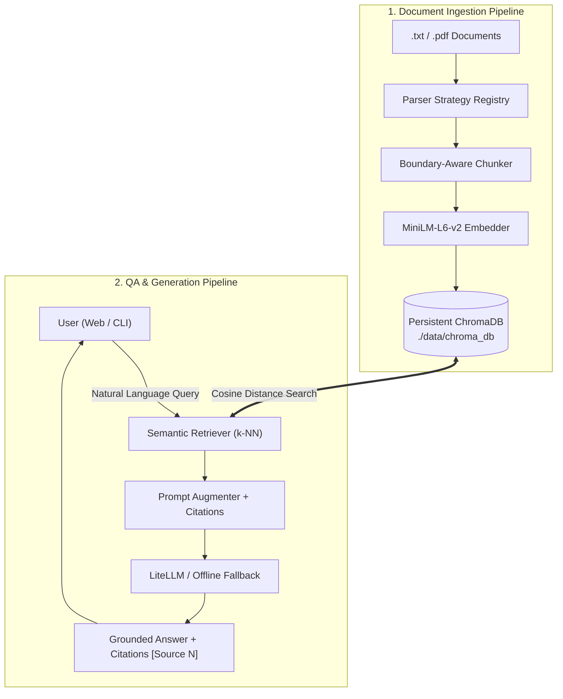

# 𝚶𝚸𝚷𝚮𝚬𝚼𝚺

     

Orpheus is a Retrieval-Augmented Generation (RAG) system with persistent vector storage, multi-provider LLM orchestration, and verifiable source citations.

---

## Overview

Orpheus ingests multi-format documents, generates dense 384-dimensional vector embeddings, indexes content in persistent ChromaDB storage, and synthesizes grounded answers with strict citation provenance and hallucination guardrails.

Application: `http://127.0.0.1:5000`  
CLI: `python3 cli.py --help`

### Key Features
* **Persistent Vector Indexing**: Documents and embeddings persist on disk in `./data/chroma_db/`, avoiding cold re-indexing across restarts.
* **Grounded Citations & Guardrails**: System enforces strict context-only generation; unsupported questions trigger standard anti-hallucination refusals.
* **Multi-Provider LLM Support**: Dispatches via LiteLLM to Google Gemini, OpenRouter, Ollama, and OpenAI, with a deterministic offline fallback.
* **Truthful Observability**: Real-time pipeline lifecycle events synchronize backend execution stages directly with client interfaces.

---

## Tech Stack

* **Backend / API**: Flask 3.0+ | Server-Sent Events (SSE) | Flask-CORS
* **Vector Database**: ChromaDB (Persistent SQLite + HNSW index)
* **Embeddings**: Sentence-Transformers `all-MiniLM-L6-v2` (384-d vector space)
* **LLM Orchestration**: LiteLLM (Gemini, OpenRouter, Ollama, OpenAI) + Offline Extractive Engine
* **CLI**: Rich Terminal TUI (`cli.py`)

---

## Architecture & Workflows



---

## Project Structure

```
rag-chat/
├── app/              # Application source code (ingestion, chunking, storage, retrieval, generation, api)
├── assets/           # System prompt templates, configuration JSON assets, and CLI themes
├── data/             # Persistent vector store, uploads, and sample documents
├── docs/             # Technical architecture guides, BRD specifications, and version changelogs
├── templates/        # Jinja2 layout templates and partials
├── tests/            # Collocated unit, security, and integration test suites
├── cli.py            # Terminal interface
├── Makefile          # Automation tasks (install, run, eval, test)
└── requirements.txt  # Python package dependencies
```

---

## Quick Start

### 1. Install Dependencies
```bash
make install
```

### 2. Configure Environment (Optional)
```bash
cp .env.example .env
```

### 3. Run the Application
```bash
# Start the server
make run

# Start the interactive CLI
make run-cli

# Run evaluation benchmark
make eval

# Run test suite
make test
```

---

## Documentation
Detailed architectural specifications and release notes are available in the [`docs/`](./docs/v0.2.0/) directory.

---

## Contributing
Contributions are warmly welcomed! Please review [CONTRIBUTING.md](CONTRIBUTING.md) for development environment setup, architectural guidelines (high cohesion, low coupling, SSOT), code formatting rules (`make lint`), and our Developer Certificate of Origin (DCO) commit sign-off process.

---

## License
This project is licensed under the GNU Affero General Public License v3.0 (AGPL-3.0). See [LICENSE](LICENSE) for full legal terms and [CONTRIBUTING.md](CONTRIBUTING.md) for contribution and project policies.

