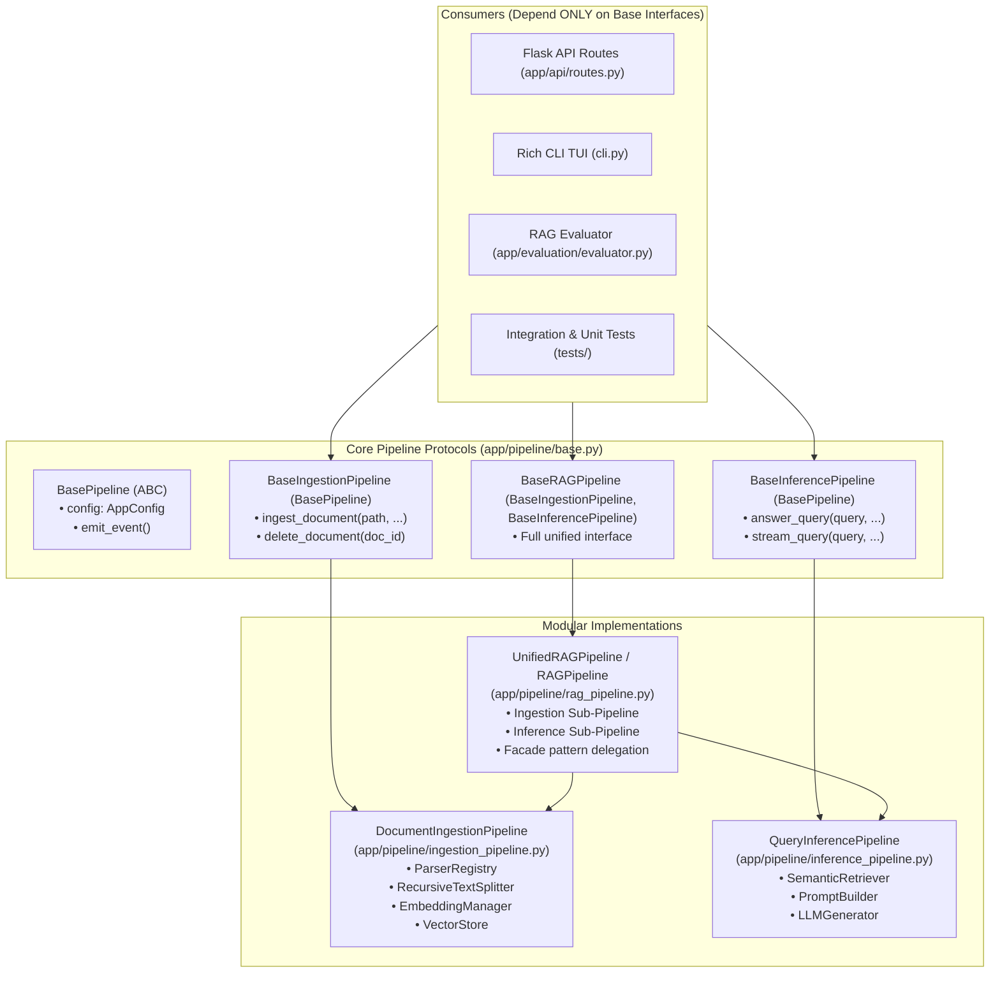

# v0.3.0 Architecture Review: Modular Pipeline Abstraction & Industry-Standard RAG Evaluation Metrics

This document provides a comprehensive, file-by-file architectural analysis and implementation plan for the two major features of the **v0.3.0** release cycle:

1. **Feature 1 (`v0.3/feat/base-pipeline-dependency`)**: Base Pipeline Dependency & True Modular Inversion
2. **Feature 2 (`v0.3/feat/rag-evaluation-metrics-and-ui`)**: Industry-Standard RAG Evaluation Metrics (Context Precision@K, Recall@K, MRR, Confusion Matrices) across Backend, CLI, and Web UI.

---

# Table of Contents
1. [Architecture Goals for v0.3.0](#architecture-goals-for-v030)
2. [Feature 1: Base Pipeline Dependency & Modularity (`v0.3/feat/base-pipeline-dependency`)](#feature-1-base-pipeline-dependency--modularity-v03featbase-pipeline-dependency)
   - [2.1 Current Architectural Deficiencies & Coupling](#21-current-architectural-deficiencies--coupling)
   - [2.2 Proposed Target Architecture & Design Patterns](#22-proposed-target-architecture--design-patterns)
   - [2.3 Detailed Class & Interface Specifications](#23-detailed-class--interface-specifications)
   - [2.4 Recursive Codebase Iteration & Line-by-Line Changes](#24-recursive-codebase-iteration--line-by-line-changes)
3. [Feature 2: Standard RAG Evaluation Metrics & Confusion Matrices (`v0.3/feat/rag-evaluation-metrics-and-ui`)](#feature-2-standard-rag-evaluation-metrics--confusion-matrices-v03featrag-evaluation-metrics-and-ui)
   - [3.1 Current Evaluation Deficiencies & Industry Gaps](#31-current-evaluation-deficiencies--industry-gaps)
   - [3.2 Mathematical Formulation of Standard Metrics](#32-mathematical-formulation-of-standard-metrics)
   - [3.3 Confusion Matrix Formulations (Retrieval & Guardrails)](#33-confusion-matrix-formulations-retrieval--guardrails)
   - [3.4 Dataset Enrichment (`EvaluationTestCase`)](#34-dataset-enrichment-evaluationtestcase)
   - [3.5 Backend Evaluator Core Redesign (`RAGEvaluator`)](#35-backend-evaluator-core-redesign-ragevaluator)
   - [3.6 Frontend UI & Interactive Confusion Matrix Redesign](#36-frontend-ui--interactive-confusion-matrix-redesign)
   - [3.7 CLI TUI Dashboard & ASCII Confusion Matrix Redesign](#37-cli-tui-dashboard--ascii-confusion-matrix-redesign)
   - [3.8 Recursive Codebase Iteration & Line-by-Line Changes](#38-recursive-codebase-iteration--line-by-line-changes)
4. [Branching, Testing, and Rollout Strategy](#44-branching-testing-and-rollout-strategy)

---

# Architecture Goals for v0.3.0

* **Inversion of Control & Interface Segregation (ISP)**: Downstream consumers (Flask API routes, CLI, Evaluators, Unit tests) must depend strictly on abstract pipeline protocols (`BaseRAGPipeline`, `BaseInferencePipeline`, `BaseIngestionPipeline`), never on concrete monolithic orchestrators.
* **Separation of Ingestion vs. Inference Concerns**: Separate indexing lifecycle (Parsers $\to$ Text Splitters $\to$ Embedders $\to$ ChromaDB) from live question-answering inference (Semantic Retriever $\to$ Prompt Augmenter $\to$ LLM Generator $\to$ Guardrails).
* **Industry-Standard IR & RAG Telemetry**: Transition from arbitrary boolean flags (`retrieval_passed`, `grounding_passed`) to standardized Information Retrieval (IR) and RAG metrics (Context Precision@K, Context Recall@K, Mean Reciprocal Rank (MRR), Hit Rate@K, and Noise Ratio).
* **Full Transparency & Confusion Matrices**: Provide rigorous 2x2 classification matrices for both **Retrieval Relevance** (TP/FP/FN/TN) and **Hallucination / Guardrail Refusal** (TP/FP/FN/TN) with visual heatmaps in the Frontend and Rich tables in the CLI.

---

# Feature 1: Base Pipeline Dependency & Modularity (`v0.3/feat/base-pipeline-dependency`)

## 2.1 Current Architectural Deficiencies & Coupling

1. **Monolithic Ingestion + Inference Coupling**:
   - `app/pipeline/rag_pipeline.py` currently binds Document Ingestion (`ingest_document`) and Query Answering (`answer_query`) into a single 505-line concrete class `RAGPipeline`.
   - An inference-only endpoint or evaluation worker is forced to instantiate document parsing logic, and background ingest workers carry generator dependencies.
2. **Missing Abstract Base Pipeline Contract**:
   - No `BasePipeline` or `BaseRAGPipeline` abstract base class (ABC) exists in `app/pipeline/`.
   - `app/api/routes.py`, `app/main.py`, `cli.py`, and `app/evaluation/evaluator.py` directly import and bind to `from app.pipeline.rag_pipeline import RAGPipeline`.
3. **Inability to Inject Sub-Pipelines or Swappable Strategies**:
   - `RAGPipeline.__init__` constructs its own `RecursiveTextSplitter`, `SemanticRetriever`, `PromptBuilder`, and `LLMGenerator`.
   - Cannot swap in a hybrid sparse/dense retriever, a reranking step, an evaluation pipeline stub, or a mock inference pipeline without editing `rag_pipeline.py`.
4. **Ad-Hoc Singleton Management in Flask Routes**:
   - `app/api/routes.py` manages a module-level variable `_default_pipeline: RAGPipeline | None = None` in `get_pipeline()`. It lacks a clean factory pattern or DI lifecycle container.

---

## 2.2 Proposed Target Architecture & Design Patterns



---

## 2.3 Detailed Class & Interface Specifications

### 1. `app/pipeline/base.py` [NEW]
```python
"""Abstract base interfaces and protocol contracts for Orpheus pipelines."""
from __future__ import annotations
from abc import ABC, abstractmethod
from pathlib import Path
from typing import Any, Dict, Iterator, List, Optional
from app.config import AppConfig
from app.pipeline.events import EventCallback, EventStage, EventStatus, PipelineEvent

class BasePipeline(ABC):
    """Base pipeline orchestrator providing lifecycle configuration and event dispatching."""
    def __init__(self, app_config: Optional[AppConfig] = None):
        self.config = app_config or AppConfig.from_env()

    def _emit_event(
        self,
        events_list: List[PipelineEvent],
        callback: Optional[EventCallback],
        stage: EventStage,
        status: EventStatus,
        message: str,
        data: Optional[Dict[str, Any]] = None,
    ) -> PipelineEvent:
        event = PipelineEvent(stage=stage, status=status, message=message, data=data or {})
        events_list.append(event)
        if callback:
            try:
                callback(event)
            except Exception as err:
                logger.error("Event callback failed: %s", err)
        return event

class BaseIngestionPipeline(BasePipeline):
    """Abstract interface for document validation, parsing, chunking, and embedding storage."""
    @abstractmethod
    def ingest_document(
        self,
        file_path: str | Path,
        chunk_size: Optional[int] = None,
        chunk_overlap: Optional[int] = None,
        event_callback: Optional[EventCallback] = None,
    ) -> IngestionResult:
        ...

    @abstractmethod
    def delete_document(self, doc_id: str) -> bool:
        ...

class BaseInferencePipeline(BasePipeline):
    """Abstract interface for question answering, semantic retrieval, and augmented generation."""
    @abstractmethod
    def answer_query(
        self,
        query: str,
        top_k: Optional[int] = None,
        score_threshold: Optional[float] = None,
        model: Optional[str] = None,
        temperature: Optional[float] = None,
        event_callback: Optional[EventCallback] = None,
    ) -> QueryResult:
        ...

    @abstractmethod
    def stream_query(
        self,
        query: str,
        top_k: Optional[int] = None,
        score_threshold: Optional[float] = None,
        model: Optional[str] = None,
        temperature: Optional[float] = None,
    ) -> Iterator[PipelineEvent]:
        ...

class BaseRAGPipeline(BaseIngestionPipeline, BaseInferencePipeline):
    """Unified composite contract for end-to-end RAG operations."""
    pass
```

### 2. `app/pipeline/ingestion_pipeline.py` [NEW]
- Implements `BaseIngestionPipeline`.
- Accepts injected `VectorStore` and `RecursiveTextSplitter`.
- Focuses exclusively on Stages 1–3: Document Reception $\to$ Text Extraction $\to$ Chunks Creation $\to$ Embeddings Generation $\to$ Vectors Stored $\to$ Indexing Complete.

### 3. `app/pipeline/inference_pipeline.py` [NEW]
- Implements `BaseInferencePipeline`.
- Accepts injected `SemanticRetriever`, `PromptBuilder`, and `LLMGenerator`.
- Focuses exclusively on Stages 4–7: Query Received $\to$ Query Embedded $\to$ Candidate Retrieval $\to$ Context Selection $\to$ Prompt Augmentation $\to$ LLM Generation.

### 4. `app/pipeline/rag_pipeline.py` [REFACTOR]
- Implements `BaseRAGPipeline`.
- Composes `DocumentIngestionPipeline` and `QueryInferencePipeline` via Dependency Injection.
- Exposes clean delegation methods:
  ```python
  class RAGPipeline(BaseRAGPipeline):
      def __init__(
          self,
          app_config: Optional[AppConfig] = None,
          ingestion_pipeline: Optional[BaseIngestionPipeline] = None,
          inference_pipeline: Optional[BaseInferencePipeline] = None,
          vector_store: Optional[VectorStore] = None,
      ):
          super().__init__(app_config=app_config)
          self.vector_store = vector_store or VectorStore(...)
          self.ingestion = ingestion_pipeline or DocumentIngestionPipeline(self.config, self.vector_store)
          self.inference = inference_pipeline or QueryInferencePipeline(self.config, self.vector_store)

      def ingest_document(self, *args, **kwargs):
          return self.ingestion.ingest_document(*args, **kwargs)

      def answer_query(self, *args, **kwargs):
          return self.inference.answer_query(*args, **kwargs)
  ```

### 5. `app/pipeline/factory.py` [NEW]
- Provides standardized factory helpers:
  - `create_rag_pipeline(app_config=..., vector_store=...) -> BaseRAGPipeline`
  - `create_inference_pipeline(app_config=..., vector_store=...) -> BaseInferencePipeline`
  - `create_ingestion_pipeline(app_config=..., vector_store=...) -> BaseIngestionPipeline`

---

## 2.4 Recursive Codebase Iteration & Line-by-Line Changes

| Module / File | Affected Lines | Proposed Changes |
| :--- | :--- | :--- |
| **`app/pipeline/base.py`** | `[NEW]` L1–L100 | Define `BasePipeline`, `BaseIngestionPipeline`, `BaseInferencePipeline`, and `BaseRAGPipeline` abstract base classes. |
| **`app/pipeline/ingestion_pipeline.py`** | `[NEW]` L1–L200 | Extract ingestion orchestration from `rag_pipeline.py` into dedicated `DocumentIngestionPipeline` implementing `BaseIngestionPipeline`. |
| **`app/pipeline/inference_pipeline.py`** | `[NEW]` L1–L250 | Extract query/answer orchestration from `rag_pipeline.py` into dedicated `QueryInferencePipeline` implementing `BaseInferencePipeline`. |
| **`app/pipeline/factory.py`** | `[NEW]` L1–L50 | Implement dependency injection factory methods `create_rag_pipeline`, `create_inference_pipeline`, `create_ingestion_pipeline`. |
| **`app/pipeline/rag_pipeline.py`** | `L79–L505` | Refactor `RAGPipeline` into a lightweight composite facade delegating to sub-pipelines. Inherit `BaseRAGPipeline`. Maintain backward compatibility. |
| **`app/pipeline/__init__.py`** | `L1–L30` | Export `BasePipeline`, `BaseIngestionPipeline`, `BaseInferencePipeline`, `BaseRAGPipeline`, `DocumentIngestionPipeline`, `QueryInferencePipeline`, `create_rag_pipeline`. |
| **`app/api/routes.py`** | `L20–L24`, `L147–L175` | Update type annotations to `BaseRAGPipeline` / `BaseInferencePipeline`. Update `get_pipeline()` to resolve via `factory.create_rag_pipeline()`. |
| **`app/main.py`** | `L34–L65` | Update `create_app(pipeline: Optional[BaseRAGPipeline] = None)` to accept any pipeline satisfying the base interface. |
| **`cli.py`** | `L105–L450` | Update type signatures `pipeline: BaseRAGPipeline` or `pipeline: BaseInferencePipeline` across `handle_ingest`, `handle_ask`, `handle_status`, `handle_evaluate`. |
| **`app/evaluation/evaluator.py`** | `L12`, `L89–L105` | Change evaluator dependency from concrete `RAGPipeline` to `BaseInferencePipeline` or `BaseRAGPipeline`, allowing evaluation of standalone inference engines. |
| **`tests/integration/test_pipeline.py`** | `L1–L145` | Add tests verifying sub-pipeline isolation (running `QueryInferencePipeline` without `DocumentIngestionPipeline`, and vice versa). |

---

# Feature 2: Standard RAG Evaluation Metrics & Confusion Matrices (`v0.3/feat/rag-evaluation-metrics-and-ui`)

## 3.1 Current Evaluation Deficiencies & Industry Gaps

| Current System Metric | Limitation | Industry Standard Replacement |
| :--- | :--- | :--- |
| **`retrieval_passed`** (Binary bool) | Only checks if expected filename string is present anywhere in retrieved chunks. Does not measure chunk-level relevance, ranking quality, or precision. | **Context Precision@K**, **Context Recall@K**, **Mean Reciprocal Rank (MRR)**, **Hit Rate@K** |
| **`grounding_passed`** (Keyword bool) | Simple substring search of keywords. Misses semantic faithfulness, extractive alignment, and factual hallucination. | **Context Faithfulness**, **Semantic Keyword Extraction Recall**, **Answer Grounding Rate** |
| **`refusal_passed`** (Binary bool) | Binary check if question was refused. Does not categorize false rejections vs. hallucination breaches. | **Guardrail Confusion Matrix** (True Refusal vs. False Refusal vs. Hallucination Leak) |
| **Aggregations** | Flat percentages (`pass_rate_pct`, `retrieval_accuracy_pct`). | **Micro & Macro Precision/Recall/F1**, **Category Breakdowns**, **2x2 Confusion Matrices** |

---

## 3.2 Mathematical Formulation of Standard Metrics

### 1. Context Precision@K ($\text{P@K}$)
Measures the proportion of retrieved chunks in the top-$k$ that are genuinely relevant to the query:
$$\text{Precision@K} = \frac{\sum_{i=1}^K \text{Relevance}(c_i)}{K}$$
Where $\text{Relevance}(c_i) \in \{0, 1\}$ indicates whether retrieved chunk $c_i$ contains ground-truth factual content or matches target source/snippet criteria.

### 2. Context Recall@K ($\text{R@K}$)
Measures the proportion of all ground-truth relevant chunks/information successfully retrieved in the top-$k$:
$$\text{Recall@K} = \frac{\sum_{i=1}^K \text{Relevance}(c_i)}{|\text{Total Relevant Context Chunks in Ground Truth}|}$$

### 3. Context F1-Score@K ($\text{F1@K}$)
Harmonic mean of Context Precision@K and Context Recall@K:
$$\text{F1@K} = 2 \cdot \frac{\text{Precision@K} \cdot \text{Recall@K}}{\text{Precision@K} + \text{Recall@K}}$$

### 4. Mean Reciprocal Rank (MRR)
Evaluates ranking position of the first relevant chunk in the retrieval output:
$$\text{RR} = \begin{cases} \frac{1}{\text{rank}_{\text{first relevant}}}, & \text{if a relevant chunk is retrieved} \\ 0, & \text{otherwise} \end{cases}$$
$$\text{MRR} = \frac{1}{|Q|} \sum_{q=1}^{|Q|} \text{RR}(q)$$

### 5. Hit Rate@K ($\text{HR@K}$)
Binary indicator whether at least one relevant context chunk is retrieved in the top-$k$:
$$\text{Hit Rate@K} = \mathbb{I}\left(\sum_{i=1}^K \text{Relevance}(c_i) > 0\right)$$

### 6. Context Noise / Distractor Ratio
Quantifies the proportion of retrieved context that is non-relevant noise:
$$\text{Noise Ratio@K} = 1 - \text{Precision@K} = \frac{\text{Irrelevant Chunks Retrieved}}{K}$$

---

## 3.3 Confusion Matrix Formulations (Retrieval & Guardrails)

### Matrix A: Retrieval Chunk Classification Confusion Matrix
Measures the retrieval engine's ability to discriminate relevant chunks from irrelevant corpus distractors:

```
                          ┌───────────────────────────┬───────────────────────────┐
                          │   Actual: RELEVANT        │   Actual: IRRELEVANT      │
┌─────────────────────────┼───────────────────────────┼───────────────────────────┤
│ Predicted: RETRIEVED    │ True Positive (TP)        │ False Positive (FP)       │
│ (In Top-K Chunks)       │ Relevant chunk in Top-K   │ Distractor/noise in Top-K │
├─────────────────────────┼───────────────────────────┼───────────────────────────┤
│ Predicted: NOT RETRIEVED│ False Negative (FN)       │ True Negative (TN)        │
│ (Omitted from Top-K)    │ Relevant chunk missed     │ Irrelevant chunk filtered │
└─────────────────────────┴───────────────────────────┴───────────────────────────┘
```
- $\text{Retrieval Precision} = \frac{\text{TP}}{\text{TP} + \text{FP}}$
- $\text{Retrieval Recall (Sensitivity)} = \frac{\text{TP}}{\text{TP} + \text{FN}}$
- $\text{Retrieval Specificity} = \frac{\text{TN}}{\text{TN} + \text{FP}}$
- $\text{Retrieval F1-Score} = \frac{2 \cdot \text{TP}}{2 \cdot \text{TP} + \text{FP} + \text{FN}}$

---

### Matrix B: Hallucination & Refusal Guardrail Confusion Matrix
Measures the RAG pipeline's safety decision (Refusal vs. Generation) against ground truth query support:

```
                          ┌───────────────────────────┬───────────────────────────┐
                          │ Actual: UNSUPPORTED QUERY │ Actual: SUPPORTED QUERY   │
                          │ (Out-of-Scope / No Fact)  │ (Valid Grounded Document) │
┌─────────────────────────┼───────────────────────────┼───────────────────────────┤
│ Decision: REFUSED       │ True Positive (TP)        │ False Positive (FP)       │
│ (Guardrail Triggered)   │ Correct Refusal (Safe)    │ False Rejection (Eager)   │
├─────────────────────────┼───────────────────────────┼───────────────────────────┤
│ Decision: ANSWERED      │ False Negative (FN)       │ True Negative (TN)        │
│ (Generation Executed)   │ Hallucination Breach!     │ Correct Grounded Answer   │
└─────────────────────────┴───────────────────────────┴───────────────────────────┘
```
- $\text{Guardrail Precision} = \frac{\text{TP}}{\text{TP} + \text{FP}}$ (When we refuse, how often was it genuinely unsupported?)
- $\text{Guardrail Recall} = \frac{\text{TP}}{\text{TP} + \text{FN}}$ (Of all unsupported questions, how many did we catch?)
- $\text{Hallucination Rate} = \frac{\text{FN}}{\text{TP} + \text{FN}}$ (Percentage of unsupported questions that leaked into hallucinated answers)
- $\text{False Rejection Rate} = \frac{\text{FP}}{\text{TN} + \text{FP}}$ (Percentage of valid questions incorrectly refused)

---

## 3.4 Dataset Enrichment (`EvaluationTestCase`)

Update `app/evaluation/test_dataset.py` to include chunk-level ground truth and target text references:

```python
@dataclass
class EvaluationTestCase:
    test_id: str
    question: str
    category: str  # 'factual_single_doc', 'factual_multi_doc', 'out_of_scope_refusal', 'technical_param'
    expected_keywords: List[str]
    expected_source_files: List[str]
    expected_snippets: List[str]            # Ground truth factual snippet substrings
    total_relevant_chunks: int              # Ground truth count for Recall@K denominator
    should_refuse: bool
    description: str
    max_length: Optional[int] = None
    require_all_keywords: bool = False
    ground_truth_answer: Optional[str] = None
```

---

## 3.5 Backend Evaluator Core Redesign (`RAGEvaluator`)

Create structured metric dataclasses in `app/evaluation/evaluator.py`:

```python
@dataclass
class ConfusionMatrix:
    tp: int = 0
    fp: int = 0
    fn: int = 0
    tn: int = 0

    @property
    def precision(self) -> float:
        return (self.tp / (self.tp + self.fp)) if (self.tp + self.fp) > 0 else 0.0

    @property
    def recall(self) -> float:
        return (self.tp / (self.tp + self.fn)) if (self.tp + self.fn) > 0 else 0.0

    @property
    def f1_score(self) -> float:
        p, r = self.precision, self.recall
        return (2 * p * r / (p + r)) if (p + r) > 0 else 0.0

    @property
    def accuracy(self) -> float:
        total = self.tp + self.fp + self.fn + self.tn
        return ((self.tp + self.tn) / total) if total > 0 else 0.0

    def to_dict(self) -> Dict[str, Any]:
        return {
            "tp": self.tp,
            "fp": self.fp,
            "fn": self.fn,
            "tn": self.tn,
            "precision": round(self.precision, 4),
            "recall": round(self.recall, 4),
            "f1_score": round(self.f1_score, 4),
            "accuracy": round(self.accuracy, 4),
        }

@dataclass
class TestCaseResult:
    test_id: str
    question: str
    category: str
    passed: bool
    # IR Metrics
    context_precision_at_k: float
    context_recall_at_k: float
    context_f1_at_k: float
    reciprocal_rank: float
    hit_at_k: bool
    noise_ratio: float
    # Guardrail evaluation
    refusal_correct: bool
    grounding_passed: bool
    citation_passed: bool
    is_refusal: bool
    retrieved_chunk_evaluations: List[Dict[str, Any]] # Chunk rank, doc, distance, is_relevant
    latency_ms: float
    failure_reasons: List[str]

@dataclass
class EvaluationReport:
    total_tests: int
    passed_tests: int
    failed_tests: int
    pass_rate_pct: float
    avg_latency_ms: float
    # Aggregate Standard IR Metrics
    mean_context_precision_at_k: float
    mean_context_recall_at_k: float
    mean_context_f1_at_k: float
    mean_reciprocal_rank (MRR): float
    overall_hit_rate_at_k: float
    avg_noise_ratio: float
    # Dual Confusion Matrices
    retrieval_confusion_matrix: ConfusionMatrix
    guardrail_confusion_matrix: ConfusionMatrix
    # Category Performance Map
    category_metrics: Dict[str, Dict[str, float]]
    results: List[TestCaseResult]
```

---

## 3.6 Frontend UI & Interactive Confusion Matrix Redesign

### Target Layout for `templates/partials/tab_evaluation.html`

```
┌────────────────────────────────────────────────────────────────────────────────────────┐
│  RAG Evaluation Benchmark & Diagnostic Suite                     [Run Full Benchmark]  │
└────────────────────────────────────────────────────────────────────────────────────────┘

┌───────────────┬───────────────┬───────────────┬───────────────┬────────────────────────┐
│ Pass Rate     │ Context P@5   │ Context R@5   │ MRR           │ Guardrail F1-Score     │
│ 90.0%         │ 84.5%         │ 92.0%         │ 0.95          │ 100.0%                 │
└───────────────┴───────────────┴───────────────┴───────────────┴────────────────────────┘

┌───────────────────────────────────────────┬────────────────────────────────────────────┐
│ 📊 Retrieval Quality Confusion Matrix     │ 🛡️ Guardrail Refusal Confusion Matrix       │
│                                           │                                            │
│            Act: Rel      Act: Irrel       │            Act: Unsup     Act: Supp        │
│ Pred: Ret  [ TP: 28 ]    [ FP: 12 ]       │ Pred: Ref  [ TP:  2 ]     [ FP:  0 ]       │
│ Pred: Omit [ FN:  2 ]    [ TN: 58 ]       │ Pred: Ans  [ FN:  0 ]     [ TN:  8 ]       │
│                                           │                                            │
│ Precision: 70.0% | Recall: 93.3%          │ Safe Precision: 100% | Hallucinations: 0%  │
└───────────────────────────────────────────┴────────────────────────────────────────────┘

┌────────────────────────────────────────────────────────────────────────────────────────┐
│  Benchmark Diagnostic Breakdown by Test Case (Category Filter: [All ▼])                │
├──────┬───────────────┬──────────────────────────┬───────┬───────┬──────┬────────┬──────┤
│ ID   │ Category      │ Question                 │ P@K   │ R@K   │ MRR  │ Status │ Lat  │
├──────┼───────────────┼──────────────────────────┼───────┼───────┼──────┼────────┼──────┤
│ EV-01│ Single Doc    │ Core collaboration hours │ 1.00  │ 1.00  │ 1.00 │ PASS   │ 412ms│
│ EV-08│ Guardrail Ref │ Interstellar travel reimb│ N/A   │ N/A   │ N/A  │ PASS   │ 210ms│
└──────┴───────────────┴──────────────────────────┴───────┴───────┴──────┴────────┴──────┘
```

### Frontend Implementation (`app/static/js/components/evaluation.js`)
- Render dynamic 2x2 colored metric grids with tooltips explaining TP, FP, FN, TN definitions.
- Implement expandable table rows allowing developers to click a test case to view the exact retrieved chunks, their distance scores, and why they were labeled as Relevant vs. Irrelevant.

---

## 3.7 CLI TUI Dashboard & ASCII Confusion Matrix Redesign

Update `cli.py` (`handle_evaluate`) using Rich `Table`, `Panel`, and `Columns`:

```
========================= Automated RAG Evaluation Benchmark =========================

─── Benchmark Test Case Results ───────────────────────────────────────────────────────
ID      Category         Question Preview          P@5   R@5   MRR   Guardrail  Status  Latency
EVAL-01 single_doc       What are the core coll... 1.00  1.00  1.00  PASS       PASS     420ms
EVAL-02 single_doc       Provide a strict bulle... 0.80  1.00  1.00  PASS       PASS     510ms
EVAL-08 out_of_scope     What is Acme's policy ... N/A   N/A   N/A   PASS       PASS     190ms

─── Retrieval Confusion Matrix ───────────   ─── Guardrail Safety Confusion Matrix ────
               Actual:Rel   Actual:Irrel                    Actual:Unsup  Actual:Supp
Pred:Retrieved   TP: 28       FP: 12         Pred:Refused      TP: 2        FP: 0
Pred:Omitted     FN:  2       TN: 58         Pred:Answered     FN: 0        TN: 8

Precision@5: 70.0% | Recall@5: 93.3%         Safe Precision: 100% | Hallucinations: 0%
Mean Reciprocal Rank (MRR): 0.950            False Rejection Rate: 0.0%

─── Benchmark Summary ────────────────────────────────────────────────────────────────
Total Tests: 10  |  Passed: 10  |  Failed: 0  |  Pass Rate: 100.0%
Mean Context Precision@5: 84.5%  |  Mean Context Recall@5: 92.0%  |  MRR: 0.950
Average Latency: 432.1ms
```

---

## 3.8 Recursive Codebase Iteration & Line-by-Line Changes

| Module / File | Affected Lines | Proposed Changes |
| :--- | :--- | :--- |
| **`app/evaluation/test_dataset.py`** | `L9–L136` | Enrich `EvaluationTestCase` with `expected_snippets`, `total_relevant_chunks`, and `ground_truth_answer`. Populate ground truth snippets across all 10 benchmark test cases. |
| **`app/evaluation/evaluator.py`** | `L15–L83` | Implement `ConfusionMatrix`, `TestCaseResult`, and `EvaluationReport` dataclasses with `precision_at_k`, `recall_at_k`, `mrr`, and confusion matrices. |
| **`app/evaluation/evaluator.py`** | `L92–L206` | Refactor `evaluate_test_case()` to evaluate chunk-level relevance, compute $P@K$, $R@K$, $\text{RR}$, and populate retrieval/guardrail confusion matrix counts. |
| **`app/evaluation/evaluator.py`** | `L207–L250` | Refactor `run_benchmark()` to aggregate Mean $P@K$, Mean $R@K$, MRR, Hit Rate, and synthesize macro/micro confusion matrices. |
| **`templates/partials/tab_evaluation.html`** | `L14–L64` | Add metric cards for Context P@K, Context R@K, MRR; add dual 2x2 visual confusion matrix cards; expand diagnostic table headers with $P@K, R@K, \text{MRR}$. |
| **`app/static/js/components/evaluation.js`** | `L8–L101` | Update DOM rendering logic to display confusion matrices, metric badges, and diagnostic chunk drawers safely without `innerHTML`. |
| **`app/static/css/components/evaluation.css`** | `[NEW]` L1–L150 | Style 2x2 confusion matrix grid cards, metric pill badges, heatmap highlights (green for TP/TN, red/amber for FP/FN). |
| **`cli.py`** | `L292–L351` | Implement Rich ASCII 2x2 confusion matrix panels, category performance breakdown, and standard IR metric reporting in `handle_evaluate()`. |
| **`app/evaluation/tests/test_evaluation.py`** | `L1–L80` | Expand test suite with unit tests verifying mathematical correctness of Precision@K, Recall@K, MRR, and confusion matrix arithmetic. |

---

# Branching, Testing, and Rollout Strategy

1. **Branch 1: `v0.3/feat/base-pipeline-dependency`**
   - **Scope**: Create `app/pipeline/base.py`, `ingestion_pipeline.py`, `inference_pipeline.py`, `factory.py`, and refactor `RAGPipeline`, `routes.py`, `cli.py`, `evaluator.py`.
   - **Verification**: Run `pytest tests/integration/test_pipeline.py` and `make lint`.
   - **Target Commit**: `feat(pipeline): extract base pipeline interfaces and decouple ingestion and inference orchestrators`

2. **Branch 2: `v0.3/feat/rag-evaluation-metrics-and-ui`**
   - **Scope**: Enrich `test_dataset.py`, implement standard IR metrics & confusion matrices in `evaluator.py`, update UI in `tab_evaluation.html` & `evaluation.js`, update CLI in `cli.py`.
   - **Verification**: Run `pytest app/evaluation/tests/` and execute `make eval`.
   - **Target Commit**: `feat(eval): add standard context precision, recall, MRR, and dual confusion matrices to evaluator, UI, and CLI`
