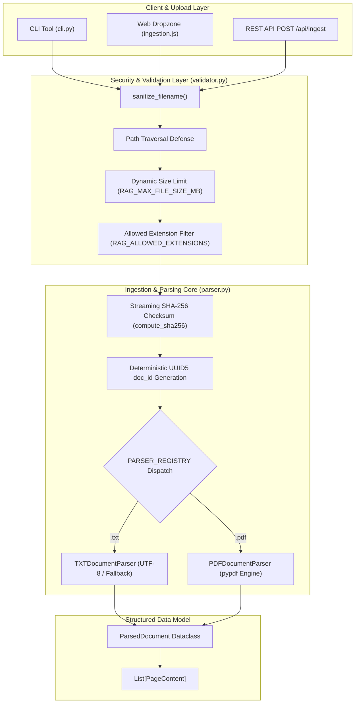
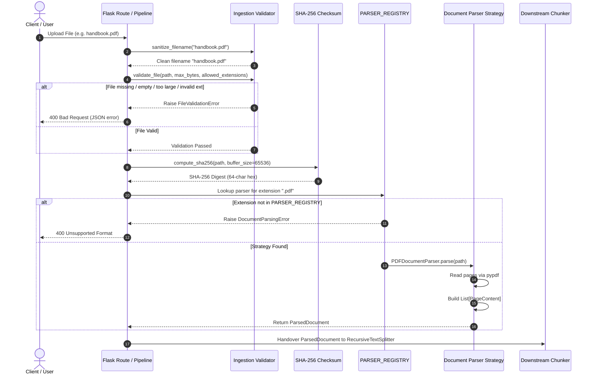
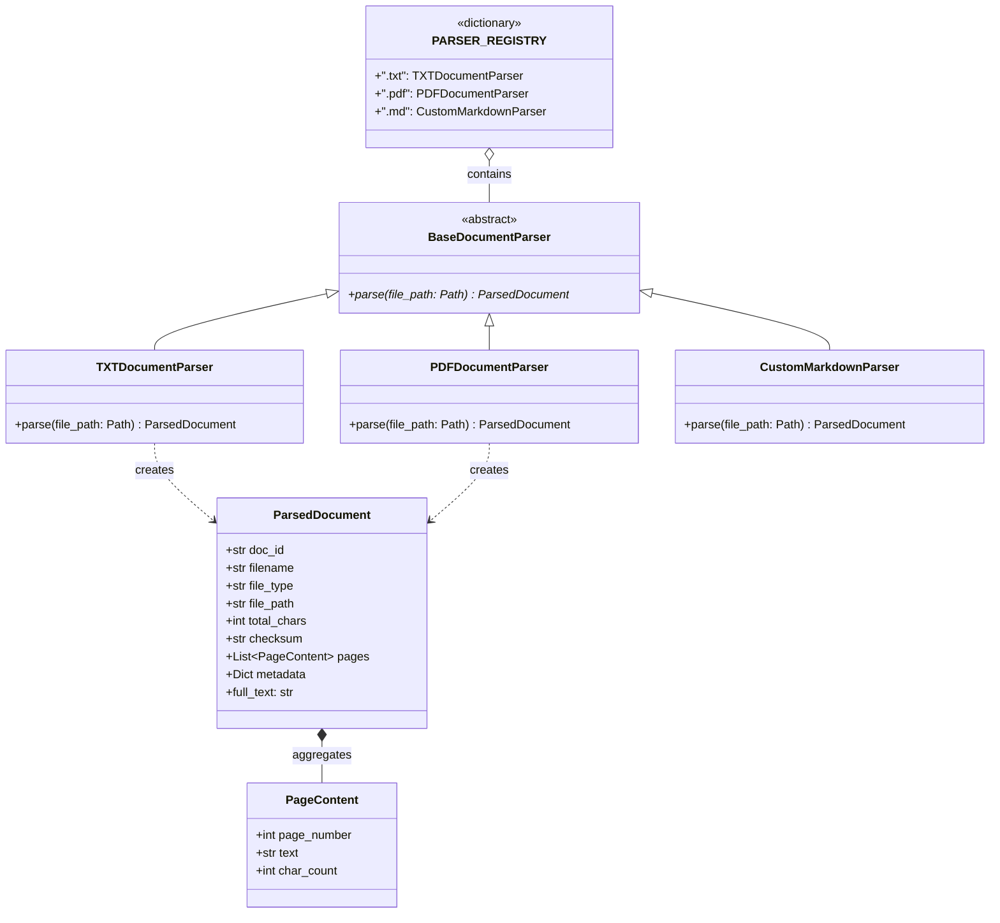
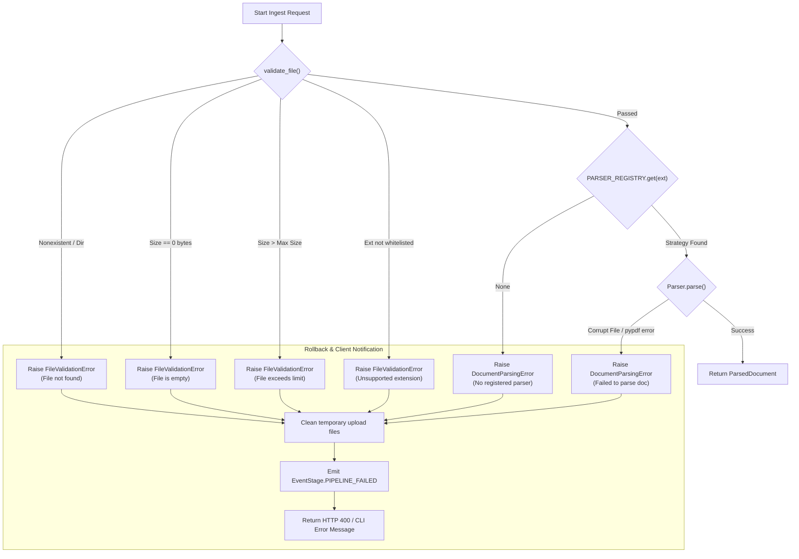

# Document Ingestion & Validation Subsystem

**BRD Requirements Addressed**:
* **FR1**: System shall accept multiple document uploads (`.txt`, `.pdf`).
* **NFR1**: Codebase should be modular (separate ingestion, retrieval, generation components).
* **NFR5**: API keys and inputs must be handled securely (path traversal prevention, sanitization, input validation).

---

## 1. Overview & Architectural Role

The **Document Ingestion & Validation Subsystem** is the entry gate for all knowledge entering the Orpheus RAG system. It is responsible for accepting raw document files from the Flask REST/SSE API, web UI dropzone, or CLI, performing defensive security and validation checks, extracting clean text with structural page-level metadata, computing deduplication checksums, and generating a standardized `ParsedDocument` representation.

In v0.2.0, this subsystem was completely refactored from a monolithic branching script into an **Open-Closed Principle (OCP) compliant Strategy Pattern** centered around `BaseDocumentParser` and a dynamic `PARSER_REGISTRY`.



---

## 2. Ingestion Lifecycle & Step-by-Step Flow

### 2.1 Forward Execution Flow
When a document is ingested, the system executes the following linear stages:

1. **Filename Sanitization (`sanitize_filename`)**:
   - Strips directory traversal sequences (`../`, `..\`), special characters, and path separators.
   - Preserves alphanumeric characters, dashes, underscores, and dots.
   - Falls back to `unnamed_.txt` if sanitization results in an empty string.
2. **File Validation (`validate_file`)**:
   - Asserts file existence and confirms the path is a regular file.
   - Checks file size against dynamic `config.storage.max_file_size_bytes` (default 10 MB, configurable via `RAG_MAX_FILE_SIZE_MB`). Rejects 0-byte empty files.
   - Validates file extension against `config.storage.allowed_extensions` (default `[".txt", ".pdf"]`, configurable via `RAG_ALLOWED_EXTENSIONS`).
3. **Streaming SHA-256 Checksum Calculation (`compute_sha256`)**:
   - Reads the file in chunks of `config.storage.hash_buffer_size` (default 64 KB = 65,536 bytes, configurable via `RAG_HASH_BUFFER_SIZE`).
   - Ensures constant memory overhead even for large multi-megabyte PDF manuals.
4. **Deterministic Document ID Generation**:
   - Generates a `UUID5` using the standard URL namespace and the SHA-256 checksum:
     $$\text{doc\_id} = \text{UUID5}(\text{NAMESPACE\_URL}, \text{"file://" + checksum})$$
   - Guaranteed deduplication: uploading the identical file under a different name produces the exact same `doc_id`.
5. **Strategy Resolution & Parsing**:
   - Extracts `file_path.suffix.lower()`.
   - Looks up parser in `PARSER_REGISTRY[ext]`.
   - Executes strategy `parse(file_path)` to extract raw text, page boundaries, character counts, and metadata.
6. **`ParsedDocument` Assembly**:
   - Populates and returns `ParsedDocument` containing `doc_id`, `filename`, `file_type`, `file_path`, `total_chars`, `checksum`, `pages: List[PageContent]`, and format-specific `metadata`.



---

## 3. Parser Strategy Pattern & Extensible Registry (OCP)

### 3.1 Class Architecture
The parser hierarchy decouples document reading from format dispatching. Adding support for a new format (such as Markdown `.md` or Word `.docx`) requires **zero modifications** to `parse_document()` or existing parsers.



### 3.2 Strategy Implementation Details

#### `TXTDocumentParser`
- Reads plain text files using `utf-8` encoding with `errors="replace"` fallback to prevent crashes on non-standard encoding bytes.
- Wraps entire content as page 1 (`PageContent(page_number=1, text=clean_text, char_count=len(clean_text))`).
- Populates metadata with `line_count` and `encoding`.

#### `PDFDocumentParser`
- Uses `pypdf.PdfReader` to extract text page-by-page.
- Tracks `page_number` (1-indexed) per page.
- Rejects corrupt or 0-page PDFs with `DocumentParsingError`.
- Records total character count and `page_count` in metadata.

#### Dynamic Extension Registration
```python
# Extending to support Markdown (.md) without modifying core code:
class MarkdownDocumentParser(BaseDocumentParser):
    def parse(self, file_path: Path) -> ParsedDocument:
        # custom parsing logic...
        ...

# One-line registration:
PARSER_REGISTRY[".md"] = MarkdownDocumentParser()
```

---

## 4. Error Handling & Backward Recovery Flow

The ingestion pipeline incorporates fail-fast, defensive error handling to prevent corrupt data from reaching the vector store:



---

## 5. Configuration Reference

| Environment Variable | Config Property | Type | Default | Description |
| :--- | :--- | :--- | :--- | :--- |
| `RAG_ALLOWED_EXTENSIONS` | `config.storage.allowed_extensions` | `List[str]` | `[".txt", ".pdf"]` | Comma-separated list of permitted document extensions. |
| `RAG_MAX_FILE_SIZE_MB` | `config.storage.max_file_size_bytes` | `int` | `10485760` (10 MB) | Maximum upload file size in megabytes, stored as bytes. |
| `RAG_HASH_BUFFER_SIZE` | `config.storage.hash_buffer_size` | `int` | `65536` (64 KB) | Buffer chunk size for streaming SHA-256 calculation. |
| `UPLOAD_DIR` | `config.storage.upload_dir` | `str` | `data/uploads` | Designated filesystem destination for uploaded documents. |

---

## 6. Verification & Automated Tests

The ingestion and validation subsystem is verified by 9 collocated unit tests in [`app/ingestion/tests/test_ingestion.py`](file:///home/remitpe/MAIN/rag-chat/app/ingestion/tests/test_ingestion.py):
* `test_sanitize_filename`: Path traversal strings (`../../../etc/passwd`) and Windows separators are stripped to a safe basename.
* `test_validate_nonexistent_file`: Nonexistent file paths raise `FileValidationError`.
* `test_validate_empty_file`: 0-byte files raise `FileValidationError`.
* `test_validate_invalid_extension`: Unpermitted file extensions raise `FileValidationError`.
* `test_validate_dynamic_size_limit`: Dynamically checks rejection when file exceeds `max_bytes` and acceptance when within limit.
* `test_validate_dynamic_allowed_extensions`: Custom allowed extension overrides dynamically validated.
* `test_compute_sha256_buffer_invariance`: Asserts identical 64-character hex digests across varying buffer sizes (64B, default, 2x).
* `test_parse_valid_txt`: Verifies full `ParsedDocument` round-trip for text files.
* `test_parser_registry_dynamic_extensibility`: Registers a custom parser, verifies parsing, and cleanly removes it in a `finally` block (OCP contract test).
