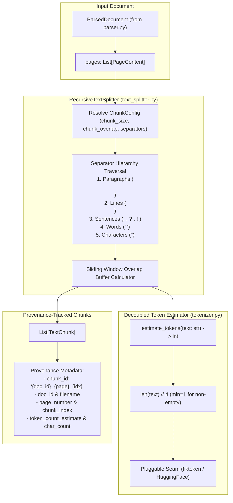
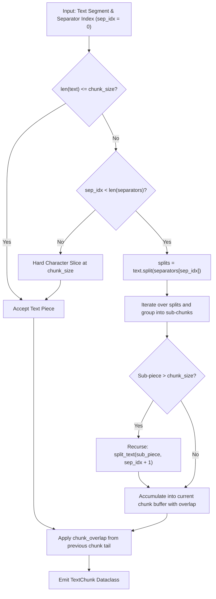
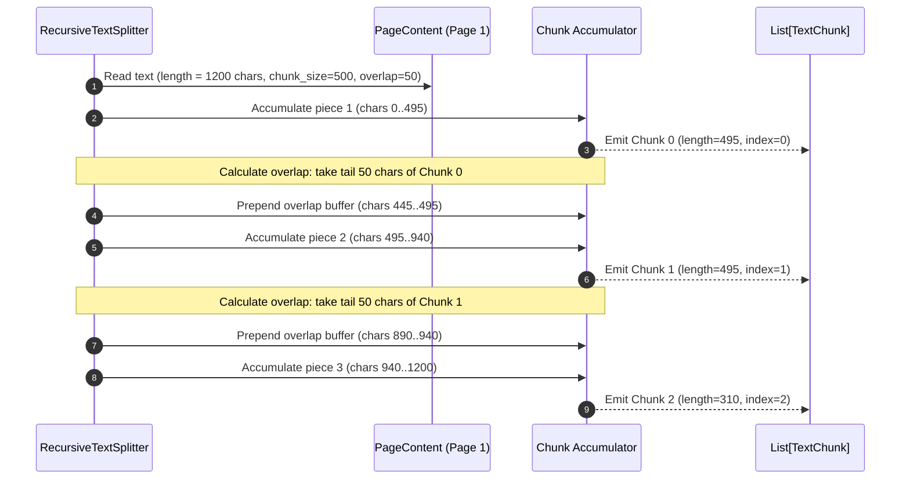
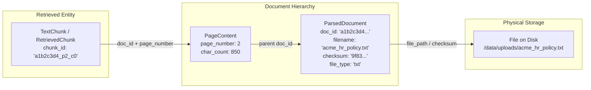

# Text Chunking & Token Estimation Subsystem

**BRD Requirements Addressed**:
* **FR2**: System shall chunk documents with configurable chunk size and overlap.
* **NFR1**: Codebase should be modular (separate ingestion, chunking, retrieval, generation components).

---

## 1. Overview & Architectural Role

The **Text Chunking & Token Estimation Subsystem** converts raw, contiguous document text (`ParsedDocument`) into discrete, semantically coherent text segments (`TextChunk`). 

Chunking is a critical phase in the RAG pipeline:
1. **Semantic Granularity**: Chunks must be small enough to isolate specific factual statements, preventing dilution in high-dimensional vector spaces.
2. **Context Window Adherence**: Chunks must fit cleanly into LLM context limits alongside system prompts and multiple citation context blocks.
3. **Boundary Integrity**: By splitting along natural linguistic boundaries (paragraphs, sentences, words) with configurable sliding overlap, the chunker avoids cutting sentences or technical phrases in half.

In v0.2.0, the subsystem was refactored to make the **separator hierarchy fully config-driven** (`REFACTOR-CHUNK-01`) and to **decouple token estimation into a standalone engine** (`REFACTOR-CHUNK-02`).



---

## 2. Recursive Text Splitting Algorithm & Separator Hierarchy

### 2.1 Recursive Splitting Mechanics
`RecursiveTextSplitter` implements a recursive descent over a prioritized list of separators. It attempts to split text using the largest semantic delimiter first (paragraphs). If a resulting segment exceeds `chunk_size`, the splitter recurses on that segment using the next finer delimiter (newlines, sentences, spaces).



### 2.2 Separator Hierarchy Sequence
The hierarchical separator sequence is defined in `ChunkConfig.separators` and configurable via `.env` (`RAG_CHUNK_SEPARATORS`):

```json
["\n\n", "\n", ". ", "? ", "! ", " ", ""]
```

1. `"\n\n"` — **Paragraph Breaks**: Preserves overarching section and paragraph coherence.
2. `"\n"` — **Line Breaks**: Preserves list items, tables, code lines, or bulleted items.
3. `". "`, `"? "`, `"! "` — **Sentence Terminations**: Ensures sentences are not broken midway.
4. `" "` — **Word Boundaries**: Splits at whitespace if a single sentence exceeds `chunk_size`.
5. `""` — **Character Level (Fallback)**: Last-resort character slicing if an unbroken token exceeds `chunk_size`.

---

## 3. Sliding Window Overlap & Mathematical Invariants

To guarantee that semantic context spanning across chunk boundaries is never lost during retrieval, `RecursiveTextSplitter` calculates a **sliding overlap buffer**:

$$\text{overlap\_len} = \min(\text{chunk\_overlap}, \text{len}(\text{previous\_chunk\_tail}))$$

### Key Mathematical Invariants:
1. **Overlap Lower Bound**:
   $$0 \le \text{chunk\_overlap} < \text{chunk\_size}$$
   *Enforced in `ChunkConfig.__post_init__()` via `ValueError` if `chunk_overlap >= chunk_size`.*
2. **Chunk Size Bound**:
   $$\text{len}(\text{chunk.content}) \le \text{chunk\_size} + \epsilon$$
   *(where $\epsilon$ is bounded by the smallest non-splittable atomic token).*
3. **Deterministic ID Invariant**:
   $$\text{chunk\_id} = f"{doc\_id}\_{page\_number}\_{chunk\_index}"$$



---

## 4. Decoupled Token Estimation Engine

In previous versions, token counting was hardcoded as `len(content) // 4` inline. In v0.2.0, this was extracted into `app/chunking/tokenizer.py`.

### 4.1 Interface Contract
```python
def estimate_tokens(text: str) -> int:
    """
    Estimate token count for a text string using character heuristics.

    Returns:
        0 for empty strings.
        max(1, len(text) // 4) for non-empty strings.
    """
    if not text:
        return 0
    return max(1, len(text) // 4)
```

### 4.2 Architectural Benefits
- **Zero Heavy Dependencies in Core**: Avoids mandatory native C-extensions like `tiktoken` in baseline environments.
- **Architectural Seam**: Downstream components (`VectorStore`, `PromptBuilder`, `RAGPipeline`) interact only with `estimate_tokens()`, enabling drop-in integration of BPE/WordPiece tokenizers in the future.
- **Reliable Lower Bounds**: Guarantees that any chunk with text reports at least `1` token, preventing zero-token division errors in evaluation benchmarks.

---

## 5. Bidirectional Provenance Traceability

Every `TextChunk` maintains complete backward provenance to its parent `ParsedDocument` and source file on disk:



### `TextChunk` Data Model
```python
@dataclass
class TextChunk:
    chunk_id: str                 # Unique ID: f"{doc_id}_{page}_{index}"
    content: str                  # Chunk textual content
    doc_id: str                   # Parent ParsedDocument UUID5
    source_filename: str          # Original sanitized filename
    page_number: int              # Source page (1-indexed)
    chunk_index: int              # Sequential index on the page
    char_count: int               # Character length
    token_count_estimate: int     # Estimated token count via estimate_tokens()
    metadata: Dict[str, Any]      # Extensible metadata dictionary
```

---

## 6. Configuration Reference

| Environment Variable | Config Property | Type | Default | Description |
| :--- | :--- | :--- | :--- | :--- |
| `RAG_CHUNK_SIZE` | `config.chunk.chunk_size` | `int` | `500` | Target maximum character length per chunk. |
| `RAG_CHUNK_OVERLAP` | `config.chunk.chunk_overlap` | `int` | `50` | Character overlap between consecutive chunks. |
| `RAG_CHUNK_SEPARATORS` | `config.chunk.separators` | `List[str]` | `["\n\n", "\n", ". ", "? ", "! ", " ", ""]` | JSON array of hierarchical delimiter fallback strings. |

---

## 7. Verification & Automated Tests

Chunking and token estimation behavior is validated by automated unit tests in [`app/chunking/tests/test_chunking.py`](file:///home/remitpe/MAIN/rag-chat/app/chunking/tests/test_chunking.py):
* `test_tokenizer_estimation`: Asserts `estimate_tokens("") == 0`, single-word strings return `1`, and multi-sentence paragraphs return proportional counts $>10$.
* `test_configurable_separators`: Verifies that a custom separator hierarchy (e.g. `["||"]`) splits `"Section A||Section B||Section C"` into exactly 3 chunks.
* `test_chunk_overlap_boundaries`: Verifies sliding overlap retention between adjacent chunks.
* `test_overlap_exceeds_size_validation`: Asserts `ValueError` when `chunk_overlap >= chunk_size`.
