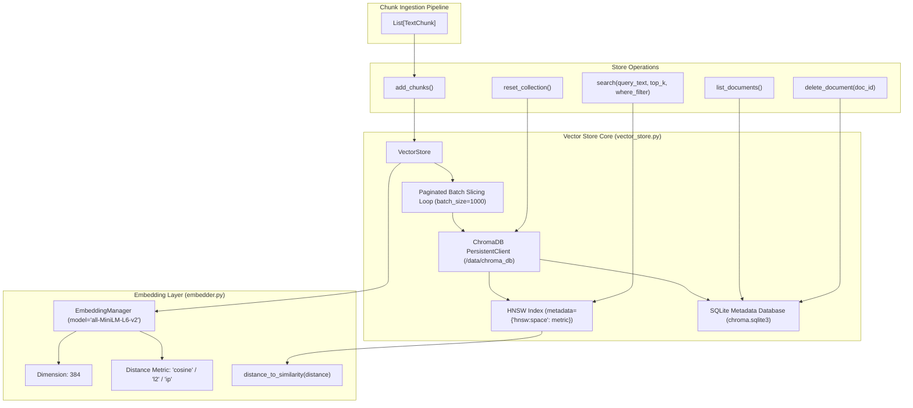
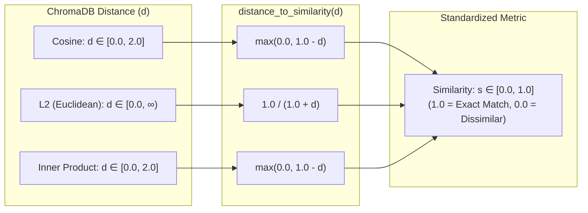
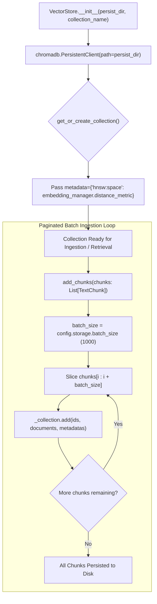
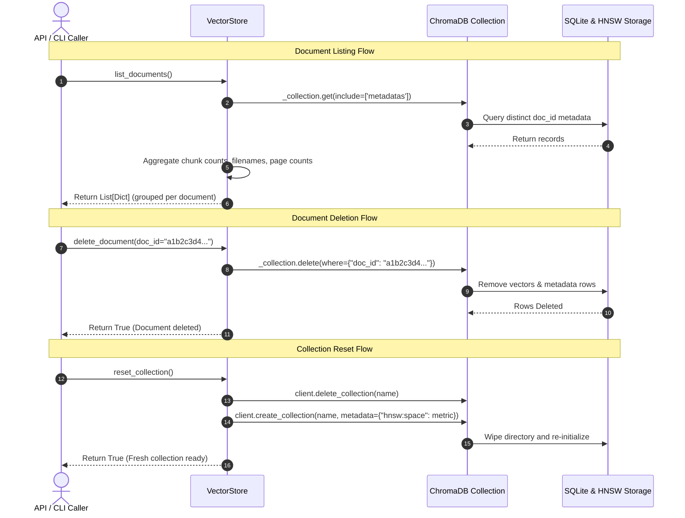

# Embedding & Persistent Vector Storage Subsystem

**BRD Requirements Addressed**:
* **FR3**: System shall generate embeddings for each chunk and store them with metadata (source file, chunk index/page).
* **NFR2**: Vector store must persist between runs (not rebuilt on every query).
* **NFR3**: System should handle at least 5–10 documents without significant performance degradation.

---

## 1. Overview & Architectural Role

The **Embedding & Persistent Vector Storage Subsystem** provides high-dimensional vector representations of text chunks and manages long-term persistence on disk via ChromaDB.

In v0.2.0, this subsystem underwent critical architectural decoupling:
1. **Dynamic Metric Geometry**: Chroma collections configure their vector space dynamically (`metadata={"hnsw:space": distance_metric}`) matching the active embedding model (`FIX-STORE-01`).
2. **Metric-Agnostic Similarity Abstraction**: Hardcoded cosine distance calculations were replaced with an abstract `distance_to_similarity()` mapper across Cosine, Euclidean ($L_2$), and Inner Product spaces (`REFACTOR-STORE-02`, `REFACTOR-EMBED-02`).
3. **Safe Paginated Batch Ingestion**: Chunks are persisted in batched increments (`config.storage.batch_size`, default 1000) to avoid SQLite parameter limit exhaustion (`REFACTOR-STORE-03`).



---

## 2. Embedding Generation & Metric Mathematics

### 2.1 Model Resolution & Architecture
`EmbeddingManager` wraps ChromaDB's underlying embedding function ecosystem:
- **Default Model**: `all-MiniLM-L6-v2` (SentenceTransformers ONNX).
- **Dimension**: 384 dense floating-point values ($d = 384$).
- **Normalized Geometry**: Vectors are normalized unit vectors ($\|\vec{v}\|_2 = 1.0$), making cosine distance mathematically equivalent to normalized Euclidean and dot product metrics.

### 2.2 Unified Distance-to-Similarity Mapping
Different vector distance spaces produce different numerical ranges. `EmbeddingManager.distance_to_similarity(d)` normalizes raw distance values into a strict, intuitive `[0.0, 1.0]` similarity score:



#### Mathematical Properties Enforced by Tests:
1. **Zero-Distance Identity**: $d = 0.0 \implies \text{similarity} = 1.0$.
2. **Monotonicity**: $d_1 < d_2 \implies \text{similarity}(d_1) \ge \text{similarity}(d_2)$.
3. **Range Invariance**: $\forall d \ge 0, \text{similarity}(d) \in [0.0, 1.0]$.

---

## 3. Persistent ChromaDB Vector Store Lifecycle

### 3.1 Persistence Architecture
`VectorStore` initializes a persistent ChromaDB instance pointing to `config.storage.persist_dir` (default `data/chroma_db/`). ChromaDB uses a dual-engine storage architecture:
- **SQLite Engine (`chroma.sqlite3`)**: Stores chunk text, IDs, and structured document metadata (`doc_id`, `filename`, `page_number`, `chunk_index`, `token_estimate`).
- **HNSW Vector Index**: Stores dense 384-dimensional vector embeddings in an Approximate Nearest Neighbor graph for $O(\log N)$ sub-millisecond retrieval.



### 3.2 Safe Chunk Batching Loop (`REFACTOR-STORE-03`)
When indexing large PDF documents (e.g. 50+ pages yielding 2,000+ chunks), executing a single un-batched insertion call risks hitting SQLite's maximum host parameter limit (`SQLITE_MAX_VARIABLE_NUMBER`).

`VectorStore.add_chunks()` partitions insertions into safe batches:
```python
batch_size = getattr(config.storage, "batch_size", 1000)
for i in range(0, total_chunks, batch_size):
    batch_ids = ids[i : i + batch_size]
    batch_docs = documents[i : i + batch_size]
    batch_meta = metadatas[i : i + batch_size]
    self._collection.add(ids=batch_ids, documents=batch_docs, metadatas=batch_meta)
    logger.info("Inserted batch %d-%d of %d chunks", i, i + len(batch_ids), total_chunks)
```

---

## 4. Document Metadata & Query Filtering

### 4.1 Stored Chunk Schema
Each chunk persisted in ChromaDB carries metadata enabling filtered retrieval:

| Metadata Key | Type | Description |
| :--- | :--- | :--- |
| `doc_id` | `str` | Deterministic UUID5 of the parent document. |
| `source_filename` | `str` | Sanitized name of the source file. |
| `page_number` | `int` | Source page number (1-indexed). |
| `chunk_index` | `int` | Sequential chunk index on that page. |
| `char_count` | `int` | Character length of the chunk content. |
| `token_count_estimate`| `int` | Heuristic token count. |

### 4.2 Document-Level Management Operations



---

## 5. Configuration Reference

| Environment Variable | Config Property | Type | Default | Description |
| :--- | :--- | :--- | :--- | :--- |
| `CHROMA_PERSIST_DIR` | `config.storage.persist_dir` | `str` | `data/chroma_db` | Filesystem directory for persistent ChromaDB storage. |
| `CHROMA_COLLECTION_NAME`| `config.storage.collection_name`| `str` | `doc_qa_collection` | Primary ChromaDB collection name. |
| `CHROMA_DISTANCE_METRIC`| `config.storage.distance_metric`| `str` | `cosine` | Vector distance space (`cosine`, `l2`, `ip`). |
| `CHROMA_BATCH_SIZE` | `config.storage.batch_size` | `int` | `1000` | Chunk count ceiling per ChromaDB batch insertion. |

---

## 6. Verification & Automated Tests

The embedding and storage subsystem is verified by collocated test suites:

### [`app/embedding/tests/test_embedding.py`](file:///home/remitpe/MAIN/rag-chat/app/embedding/tests/test_embedding.py) (5 tests):
* `test_embedding_manager_properties_consistency`: Verifies `dimension == 384` and `distance_metric` consistency.
* `test_distance_to_similarity_mathematical_invariants`: Tests identity ($d=0 \implies 1.0$), bounds $[0.0, 1.0]$, and monotonicity.
* `test_distance_to_similarity_across_supported_metrics`: Monkeypatches distance metric to `cosine`, `ip`, and `l2` and asserts formula exactness.
* `test_embed_documents_batch_invariance`: Confirms vector output shape ($N \times 384$).

### [`app/storage/tests/test_vector_store.py`](file:///home/remitpe/MAIN/rag-chat/app/storage/tests/test_vector_store.py) (7 tests):
* `test_vector_store_add_and_search`: Round-trip chunk addition and semantic query retrieval.
* `test_vector_store_list_and_delete`: Documents listing and atomic deletion by `doc_id`.
* `test_vector_store_dynamic_hnsw_metadata`: Asserts `collection.metadata["hnsw:space"]` matches embedding metric.
* `test_vector_store_reset_collection_preserves_metadata`: Collection reset preserves HNSW space metadata.
* `test_vector_store_batch_insertion_slicing`: Ingestion with dynamic `batch_size = 2` preserves all records without loss.
* `test_vector_store_similarity_delegation`: Verifies search result similarity delegates to `EmbeddingManager`.
