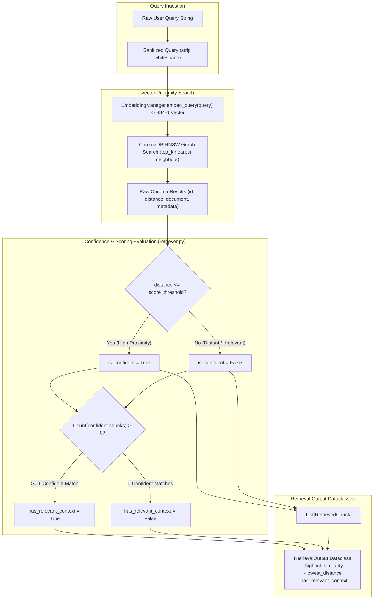
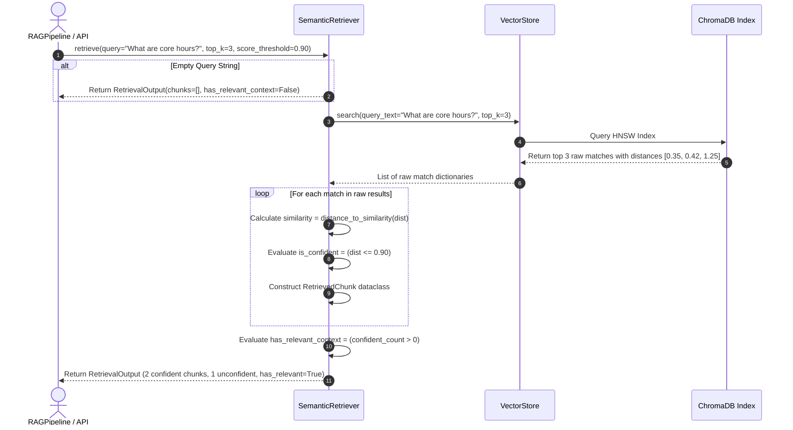
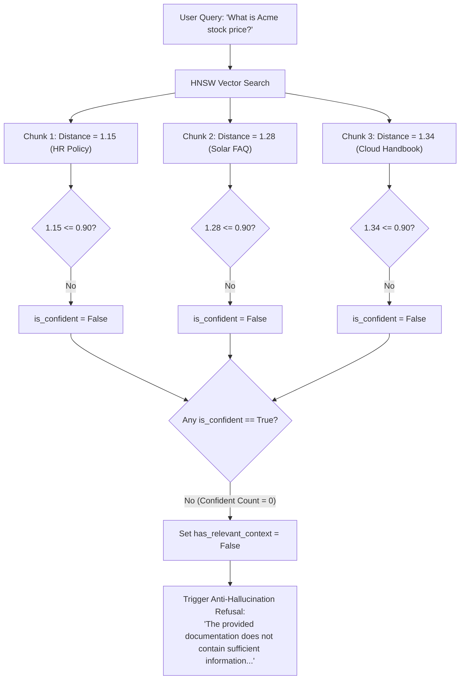

# Semantic Retrieval & Confidence Scoring Subsystem

**BRD Requirements Addressed**:
* **FR4**: System shall retrieve top-k most relevant chunks for a given user query.
* **FR7**: System shall return a clear "no relevant information found" response when retrieval confidence is low, instead of fabricating an answer.
* **NFR1**: Codebase should be modular (separate ingestion, retrieval, generation components).
* **NFR3**: System should handle 5–10 documents without performance degradation.

---

## 1. Overview & Architectural Role

The **Semantic Retrieval & Confidence Scoring Subsystem** bridges user queries and the persistent vector database. It transforms natural language questions into vector embeddings, performs nearest-neighbor vector search, ranks candidate text segments, calculates normalized semantic similarity, and applies strict **confidence thresholding** to decide whether sufficient factual context exists to proceed with generation.

In v0.2.0, the retriever documentation and logic were refactored to be completely **metric-agnostic** (`REFACTOR-RETRIEVAL-01`), delegating distance math directly to the dynamic storage layer.



---

## 2. Retrieval Workflow & Sequence

### 2.1 Step-by-Step Retrieval Execution Flow
1. **Query Validation**:
   - Strips leading/trailing whitespace.
   - If empty, returns immediately with an empty `RetrievalOutput(has_relevant_context=False, chunks=[])` without making unnecessary database or embedding calls (Rate Limit mitigation).
2. **Nearest-Neighbor Vector Search (`VectorStore.search`)**:
   - Embeds query using the active MiniLM embedding function.
   - Queries ChromaDB collection for the `top_k` nearest neighbors (default $k = 3$, configurable via `RAG_TOP_K`).
   - Supports optional scoped search via `where={"doc_id": filter_doc_id}`.
3. **Distance & Similarity Conversion**:
   - Distance ($d$) represents the spatial separation in the collection's vector space.
   - Delegates to `EmbeddingManager.distance_to_similarity(d)` to populate `similarity` $\in [0.0, 1.0]$.
4. **Confidence Threshold Filtering**:
   - Compares raw distance against `score_threshold` (default $0.90$, configurable via `RAG_SCORE_THRESHOLD`).
   - Lower distance signifies higher semantic proximity. Chunks satisfying:
     $$d \le \text{score\_threshold}$$
     are tagged `is_confident = True`.
5. **Context Relevance Determination**:
   - If at least one retrieved chunk satisfies the confidence threshold, `has_relevant_context` is set to `True`.
   - If all retrieved chunks exceed the distance threshold (or 0 chunks returned), `has_relevant_context` is set to `False`. This flag is the primary trigger for the **FR7 anti-hallucination guardrail**.



---

## 3. Confidence Thresholding & Decision Logic

The confidence scoring system prevents hallucination when users ask questions outside the domain of the ingested documents (e.g. asking about interstellar space travel when only HR policies are indexed).



---

## 4. Data Model Contracts

### 4.1 `RetrievedChunk`
```python
@dataclass
class RetrievedChunk:
    rank: int                     # 1-indexed retrieval ranking
    chunk_id: str                 # Unique chunk identifier
    content: str                  # Chunk textual content
    doc_id: str                   # Parent document UUID5
    source_filename: str          # Original filename
    page_number: int              # Page where chunk resides
    chunk_index: int              # Chunk position index on page
    distance: float               # Raw vector distance from query
    similarity: float             # Normalized similarity in [0.0, 1.0]
    is_confident: bool            # True if distance <= score_threshold
    metadata: Dict[str, Any]      # Extensible metadata dictionary
```

### 4.2 `RetrievalOutput`
```python
@dataclass
class RetrievalOutput:
    query: str                    # Original query string
    chunks: List[RetrievedChunk]  # All candidate chunks retrieved
    has_relevant_context: bool    # True if at least 1 chunk is confident
    top_k: int                    # Maximum candidate limit requested
    score_threshold: float        # Applied distance threshold
    total_indexed_chunks: int     # Total chunks in vector store at query time

    @property
    def highest_similarity(self) -> float:
        """Similarity score of the top-ranked match, or 0.0 if empty."""
        return max(c.similarity for c in self.chunks) if self.chunks else 0.0

    @property
    def lowest_distance(self) -> float:
        """Distance score of the top-ranked match, or 2.0 if empty."""
        return min(c.distance for c in self.chunks) if self.chunks else 2.0
```

---

## 5. Configuration Reference

| Environment Variable | Config Property | Type | Default | Description |
| :--- | :--- | :--- | :--- | :--- |
| `RAG_TOP_K` | `config.retrieval.top_k` | `int` | `3` | Number of top nearest chunks to retrieve per query. |
| `RAG_SCORE_THRESHOLD`| `config.retrieval.score_threshold`| `float` | `0.90` | Maximum distance bound for a chunk to be marked confident. |

---

## 6. Verification & Automated Tests

The retrieval subsystem is verified by 6 unit tests in [`app/retrieval/tests/test_retrieval.py`](file:///home/remitpe/MAIN/rag-chat/app/retrieval/tests/test_retrieval.py):
* `test_retrieval_matches_relevant_chunk`: Asserts semantic query returns topically relevant chunk with `is_confident=True`.
* `test_retrieval_empty_query`: Empty string returns 0 chunks and `has_relevant_context=False`.
* `test_retrieval_dynamic_score_threshold_override`: Strict threshold (`0.001`) marks all chunks unconfident; relaxed threshold (`2.0`) marks all confident.
* `test_retrieval_dynamic_top_k_slicing`: Asserts exact count boundary adherence (`top_k=1` returns 1, `top_k=2` returns 2).
* `test_retrieval_doc_id_filter`: Verifies that filtering by `doc_id="d1"` returns only chunks originating from that document.
* `test_retrieval_output_properties`: Validates `highest_similarity` and `lowest_distance` calculation invariants.
