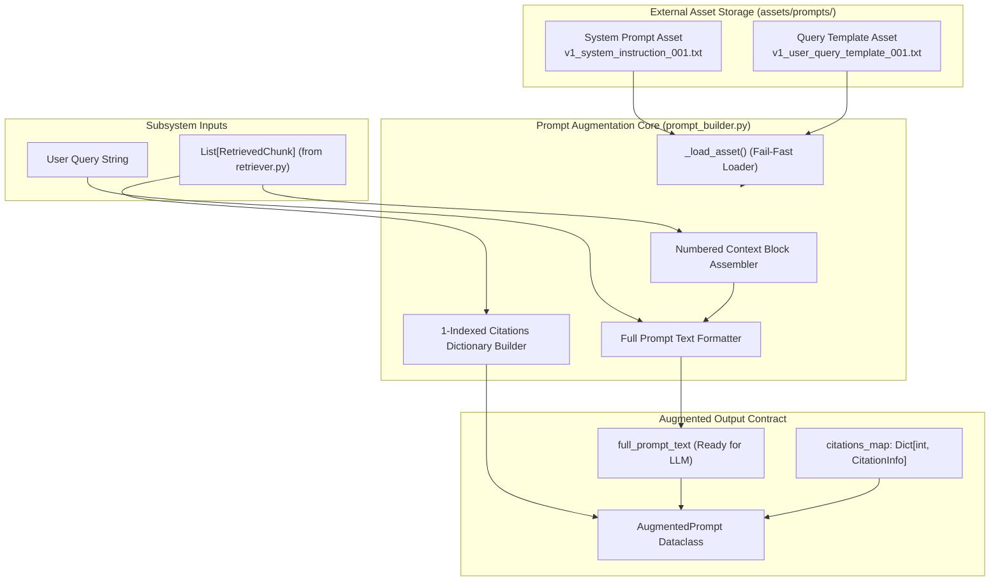
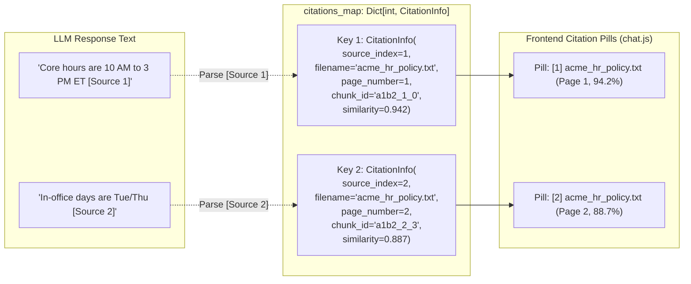
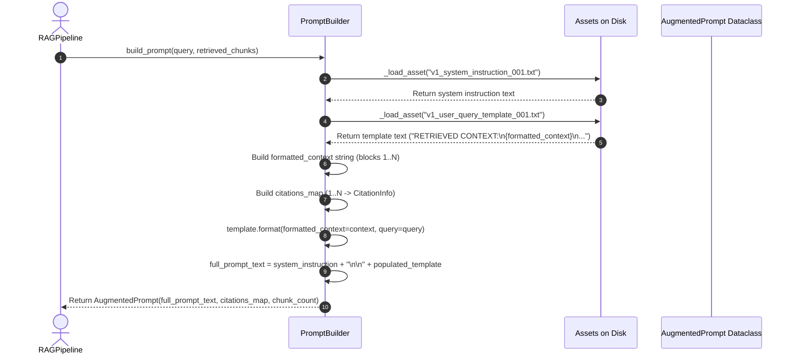

# Prompt Augmentation & Citation Provenance Subsystem

**BRD Requirements Addressed**:
* **FR5**: System shall generate an answer using retrieved chunks as context, via an LLM call.
* **FR6**: System shall cite the source document(s) for each generated answer.
* **FR7**: System shall return a clear "no relevant information found" response when retrieval confidence is low, instead of fabricating an answer.

---

## 1. Overview & Architectural Role

The **Prompt Augmentation & Citation Provenance Subsystem** acts as the synthesis bridge between raw retrieved chunks and the LLM generation engine. It formats retrieved context chunks into structured, indexed blocks, attaches granular citation metadata (source file, page, chunk index, similarity), loads versioned system instructions, and enforces the **strict anti-hallucination grounding contract**.

In v0.2.0, hardcoded prompt strings were completely extracted into **versioned external assets** in `assets/prompts/` (`FEAT-PROMPT-01`), enabling prompt engineering and versioning independent of Python code releases.



---

## 2. Externalized Versioned Prompt Asset Architecture

### 2.1 Directory Structure
Prompts are versioned and stored under the `assets/prompts/` root:
```
assets/prompts/
├── system-prompts/
│   └── v1_system_instruction_001.txt        # Grounded system persona & rules
└── full-prompt-templates/
    └── v1_user_query_template_001.txt       # Structured context + query template
```

### 2.2 System Instruction Grounding Contract
The system prompt (`v1_system_instruction_001.txt`) defines the 5 non-negotiable rules governing the model's output:

1. **Strict Context Grounding**: Rely *exclusively* on facts directly stated in the `RETRIEVED CONTEXT`. Never extrapolate, speculate, or draw from prior training knowledge.
2. **Explicit Bracketed Citations**: Attribute every factual claim to its source block using `[Source N]` or `[N]` notation (e.g. `"...core hours are 10:00 AM to 3:00 PM ET [Source 1]."`).
3. **Mandatory Refusal on Missing Information**: If the context does not contain sufficient facts to answer the question with complete confidence, reply strictly with:
   $$\text{"The provided documentation does not contain sufficient information to answer this question."}$$
4. **No Contradiction**: Never state as fact any claim that contradicts the provided context.
5. **Concise & Direct**: Answer concisely without conversational filler, preamble, or apologies.

---

## 3. Context Block Formatting & 1-Indexed Citation Mapping

### 3.1 Context Formatting Algorithm
When retrieved chunks are provided, `PromptBuilder._format_context_blocks()` iterates over the candidate list and constructs numbered source blocks:

```
[Source 1: acme_hr_policy.txt (Page 1, Chunk 0, Similarity: 0.942)]
Standard core hours are 10:00 AM to 3:00 PM Eastern Time. All employees are expected to be available...

[Source 2: acme_hr_policy.txt (Page 2, Chunk 3, Similarity: 0.887)]
Employees working hybrid schedules must be present in the office on Tuesdays and Thursdays...
```

If no chunks are provided or the context list is empty, the formatter outputs:
```
[NO RELEVANT CONTEXT FOUND]
```

### 3.2 1-Indexed Citation Dictionary (`citations_map`)
To ensure reliable provenance, `PromptBuilder` builds a 1-indexed dictionary mapping source number integers to `CitationInfo` objects:



---

## 4. Prompt Assembly Sequence



---

## 5. Data Model Contracts

### 5.1 `CitationInfo`
```python
@dataclass
class CitationInfo:
    source_index: int             # 1-indexed citation number matching [Source N]
    filename: str                 # Original document filename
    page_number: int              # Document page number
    chunk_id: str                 # TextChunk unique identifier
    similarity: float             # Proximity score in [0.0, 1.0]
    snippet: str                  # First 120 characters of chunk text
    doc_id: str                   # Parent document UUID5
```

### 5.2 `AugmentedPrompt`
```python
@dataclass
class AugmentedPrompt:
    system_instruction: str       # Grounded system instructions loaded from asset
    formatted_context: str        # Numbered context blocks or [NO RELEVANT CONTEXT FOUND]
    user_query: str               # Cleaned user question
    full_prompt_text: str         # Complete prompt text submitted to the LLM
    citations_map: Dict[int, CitationInfo]  # Integer to CitationInfo lookup
    chunk_count: int              # Number of context chunks included
```

---

## 6. Verification & Automated Tests

The prompt augmentation subsystem is verified by 6 unit tests in [`app/augmentation/tests/test_prompt_builder.py`](file:///home/remitpe/MAIN/rag-chat/app/augmentation/tests/test_prompt_builder.py):
* `test_prompt_builder_asset_loading`: Confirms file-based loading of `system_instruction` and `query_template`.
* `test_load_asset_missing_file_raises_filenotfound`: Asserts fail-fast `FileNotFoundError` with descriptive remediation when asset is missing.
* `test_prompt_builder_citation_mapping_and_indexing`: Validates 1-indexed citation dictionary keys, chunk metadata integrity, and context header format.
* `test_prompt_builder_empty_chunks_fallback`: Asserts fallback to `[NO RELEVANT CONTEXT FOUND]`, empty citations map, and zero chunk count when no chunks are provided.
* `test_prompt_builder_custom_system_instruction_override`: Verifies constructor override capability for custom instructions.
* `test_citation_info_and_augmented_prompt_to_dict`: Tests JSON-serializable dictionary conversions.
