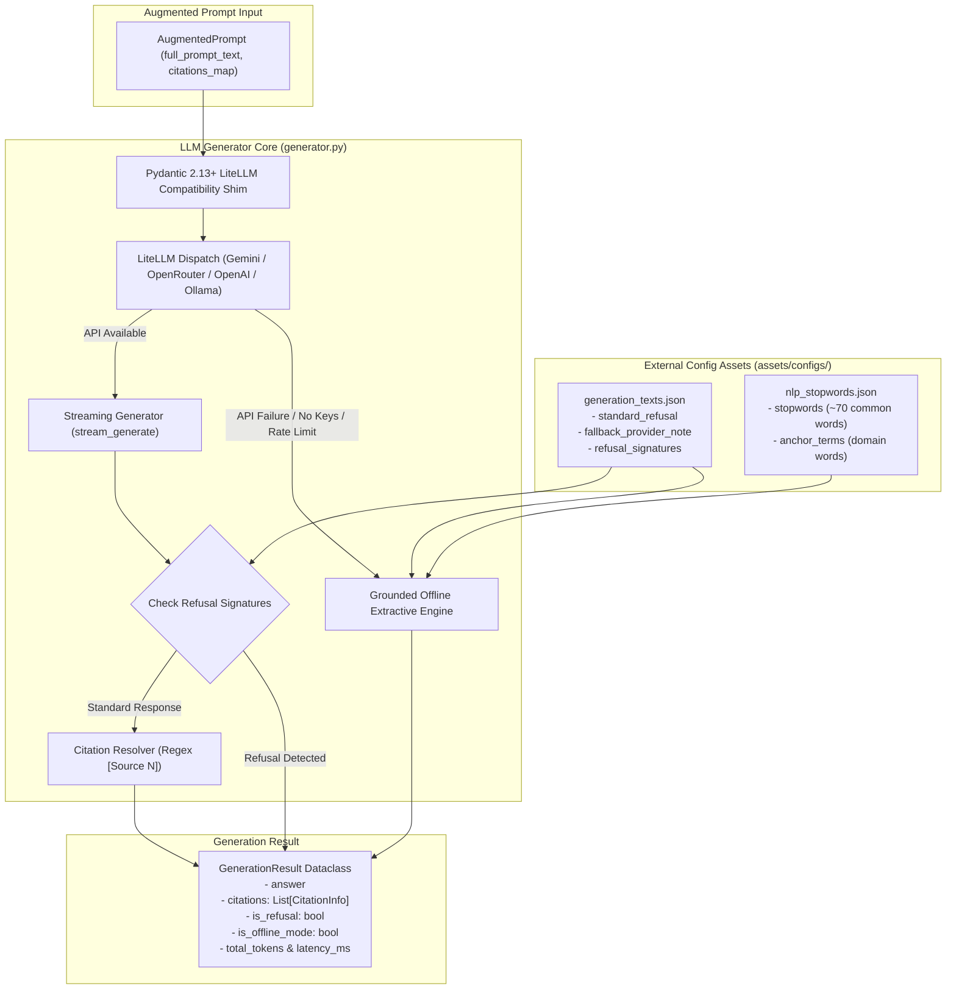
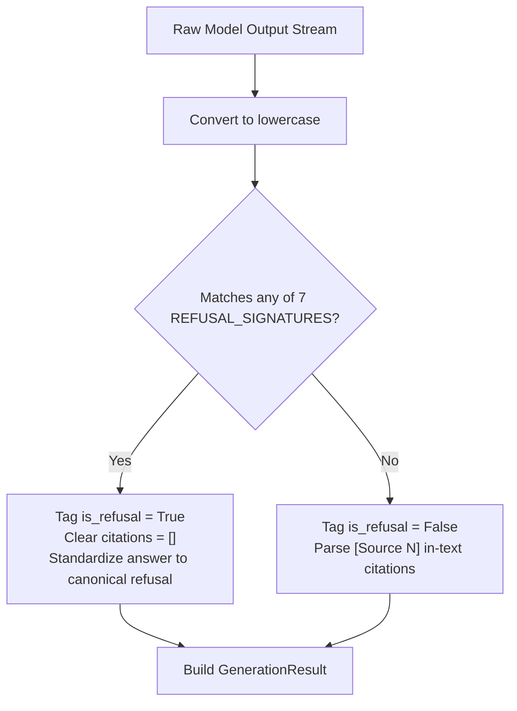
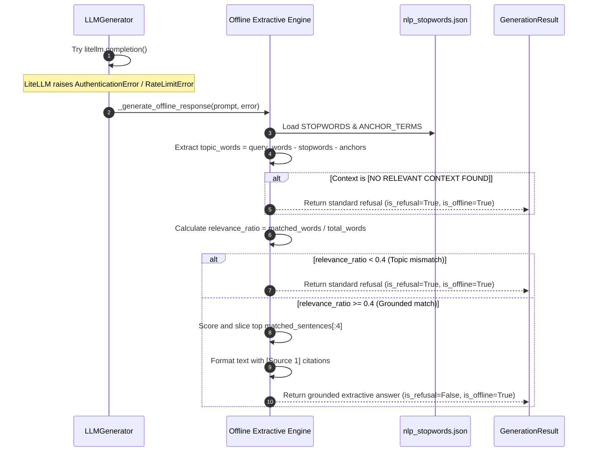

# LLM Generation, Guardrails & Offline Fallback Subsystem

**BRD Requirements Addressed**:
* **FR5**: System shall generate an answer using retrieved chunks as context, via an LLM call (OpenRouter or Google AI Studio API).
* **FR6**: System shall cite the source document(s) for each generated answer.
* **FR7**: System shall return a clear "no relevant information found" response when retrieval confidence is low, instead of fabricating an answer.
* **NFR4**: Solution should access LLMs via OpenRouter or Google AI Studio API keys.
* **NFR5**: API keys must be stored securely (environment variables, .env file) and masked in logs.

---

## 1. Overview & Architectural Role

The **LLM Generation, Guardrails & Offline Fallback Subsystem** handles synthesis of natural language answers from retrieved context. It abstracts multi-provider API communication through LiteLLM, enforces strict **anti-hallucination refusal guardrails**, extracts source citations from model output, and provides a **deterministic, grounded offline fallback engine** when external API providers are unreachable, unconfigured, or rate-limited.

In v0.2.0, this subsystem was hardened with a **Pydantic 2.13+ runtime compatibility shim**, **externalized NLP and refusal configuration assets** in `assets/configs/`, and **configurable offline fallback thresholds** (`FIX-GEN-01`, `REFACTOR-GEN-02`, `REFACTOR-GEN-03`, `FIX-GEN-04`, `FIX-GEN-05`).



---

## 2. Multi-Provider LLM Orchestration & Pydantic 2.13+ Shim

### 2.1 Supported Providers & Models
The generation layer is backed by `litellm.completion()`, allowing seamless runtime switching between providers via `LLM_MODEL`:

| Provider | Model String Example | Required Environment Variable |
| :--- | :--- | :--- |
| **Google AI Studio / Gemini** (Default) | `gemini/gemini-1.5-flash` | `GEMINI_API_KEY` or `GOOGLE_API_KEY` |
| **OpenRouter** | `openrouter/meta-llama/llama-3.1-8b-instruct` | `OPENROUTER_API_KEY` |
| **OpenAI** | `openai/gpt-4o-mini` | `OPENAI_API_KEY` |
| **Local Ollama** | `ollama/llama3` | `OLLAMA_API_BASE` (default `http://localhost:11434`) |

### 2.2 Runtime Pydantic 2.13+ Compatibility Shim
Modern Pydantic releases enforce strict validation on dynamically imported models, causing LiteLLM versions to raise `PydanticUserError` on missing schema classes.

`app/generation/generator.py` includes a self-healing import block:
```python
try:
    from litellm.types import utils as litellm_utils
    # Check if ChatCompletionReasoningSummaryTextBlock exists
    if not hasattr(litellm_utils, "ChatCompletionReasoningSummaryTextBlock"):
        class ChatCompletionReasoningSummaryTextBlock(BaseModel):
            summary: Optional[str] = None
        litellm_utils.ChatCompletionReasoningSummaryTextBlock = ChatCompletionReasoningSummaryTextBlock
    
    # Rebuild affected models
    if hasattr(litellm_utils, "Message") and hasattr(litellm_utils.Message, "model_rebuild"):
        litellm_utils.Message.model_rebuild()
except Exception:
    pass
```

---

## 3. Hallucination Refusal Guardrails

### 3.1 Refusal Signatures & Asset Management
Refusal texts and detection patterns are stored in `assets/configs/generation_texts.json`:

```json
{
  "standard_refusal": "The provided documentation does not contain sufficient information to answer this question.",
  "refusal_signatures": [
    "does not contain sufficient information",
    "insufficient information",
    "cannot find any information",
    "context does not mention",
    "no relevant context found",
    "not mentioned in the provided",
    "unable to answer based on the provided"
  ]
}
```

### 3.2 Refusal Detection Logic
When the model produces an answer (or when the offline engine evaluates context), `LLMGenerator._is_refusal_response(answer)` scans the text against all lowercase `REFUSAL_SIGNATURES`.

If a match is found:
- `is_refusal` is set to `True`.
- `citations` list is cleared to `[]` (refusals must not cite irrelevant sources).
- `answer` is standardized to `DEFAULT_REFUSAL_TEXT`.



---

## 4. Grounded Offline Extractive Fallback Engine

When external API keys are not provided, rate limits are exceeded, or network connectivity is unavailable, `LLMGenerator` falls back to an offline extractive engine instead of failing.

### 4.1 Keyword Extraction & Matching Pipeline
1. **Stopwords & Anchor Filtering**:
   - Queries are tokenized and stripped of ~70 common English words (`assets/configs/nlp_stopwords.json`).
   - Domain anchor terms (`acme`, `corporation`, `system`) are removed to prevent false context overlap.
2. **Topic Relevance Threshold (`LLM_OFFLINE_TOPIC_THRESHOLD`)**:
   - Computes query topic word presence in retrieved context:
     $$\text{relevance\_ratio} = \frac{\text{Count}(\text{topic\_words} \in \text{context})}{\text{Total Topic Words}}$$
   - If $\text{relevance\_ratio} < \text{offline\_topic\_threshold}$ (default `0.4` = 40%), the engine refuses with `DEFAULT_REFUSAL_TEXT` and `is_refusal=True`.
3. **Sentence Bounding (`LLM_OFFLINE_MAX_SENTENCES`)**:
   - Context is split into sentences. Sentences matching query keywords are selected up to `offline_max_sentences` (default `4`).
   - Synthesizes the extracted sentences with inline `[Source N]` citations and prepends a provider fallback notice.



---

## 5. In-Text Citation Resolution

The generator scans generated text using regular expressions (`r'\[Source\s*(\d+)\]'` and `r'\[(\d+)\]'`) to extract source index references.

```python
cited_indices = set(re.findall(r'\[(?:Source\s*)?(\d+)\]', answer_text, re.IGNORECASE))
resolved_citations = [
    prompt.citations_map[int(idx)]
    for idx in sorted(cited_indices, key=int)
    if int(idx) in prompt.citations_map
]
```

---

## 6. Configuration Reference

| Environment Variable | Config Property | Type | Default | Description |
| :--- | :--- | :--- | :--- | :--- |
| `LLM_MODEL` | `config.llm.model` | `str` | `gemini/gemini-1.5-flash` | LiteLLM provider model identifier. |
| `LLM_TEMPERATURE` | `config.llm.temperature` | `float` | `0.2` | Generation temperature (low for groundedness). |
| `LLM_MAX_TOKENS` | `config.llm.max_tokens` | `int` | `1024` | Maximum token ceiling for model completions. |
| `LLM_DEBUG_INFO` | `config.llm.suppress_debug_info` | `bool` | `false` (suppressed) | Toggle verbose LiteLLM logging telemetry. |
| `LLM_OFFLINE_TOPIC_THRESHOLD`| `config.llm.offline_topic_threshold`| `float` | `0.4` | Offline fallback relevance match ratio threshold. |
| `LLM_OFFLINE_MAX_SENTENCES`| `config.llm.offline_max_sentences`| `int` | `4` | Sentence count upper bound for offline answers. |

---

## 7. Verification & Automated Tests

The generation subsystem is verified by 7 unit tests in [`app/generation/tests/test_generator.py`](file:///home/remitpe/MAIN/rag-chat/app/generation/tests/test_generator.py):
* `test_generator_telemetry_configuration`: Confirms `suppress_debug_info` dynamically sets `litellm.suppress_debug_info`.
* `test_load_json_asset_fail_fast`: Asserts `FileNotFoundError` when a JSON asset is missing.
* `test_nlp_assets_loaded_successfully`: Validates `STOPWORDS` and `ANCHOR_TERMS` non-empty set population.
* `test_generator_offline_refusal_on_empty_context`: Asserts refusal on `[NO RELEVANT CONTEXT FOUND]`.
* `test_generator_offline_refusal_on_unmatched_topics`: Asserts refusal on out-of-domain queries (e.g. chocolate cake vs Redis cache context).
* `test_generator_offline_extractive_grounding_and_sentence_limit`: Validates factual sentence extraction, in-text citation presence, and `max_sentences <= 4` adherence.
* `test_generation_result_to_dict`: Tests JSON serialization of generation results.
