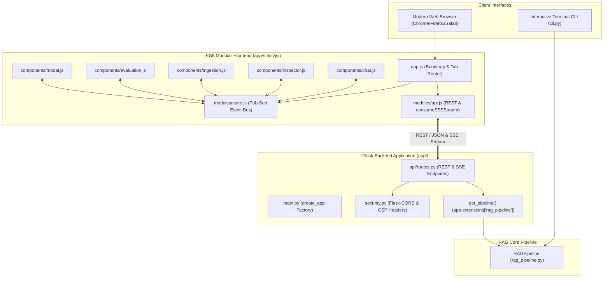
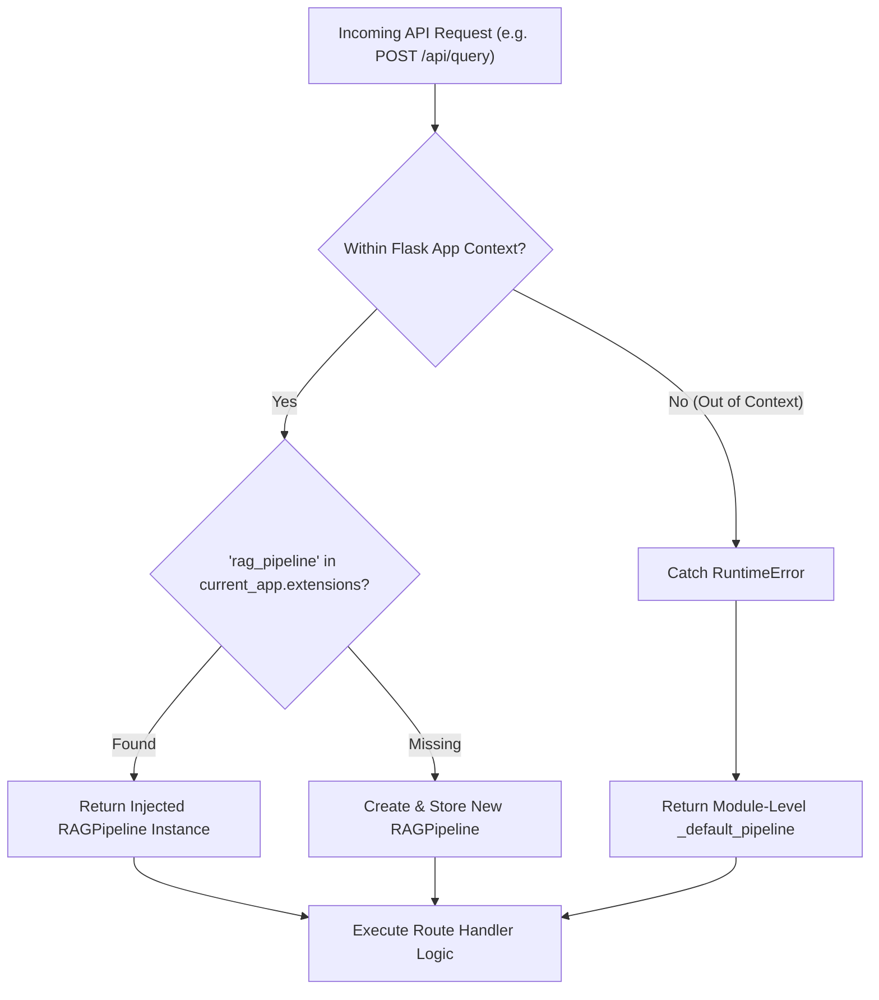
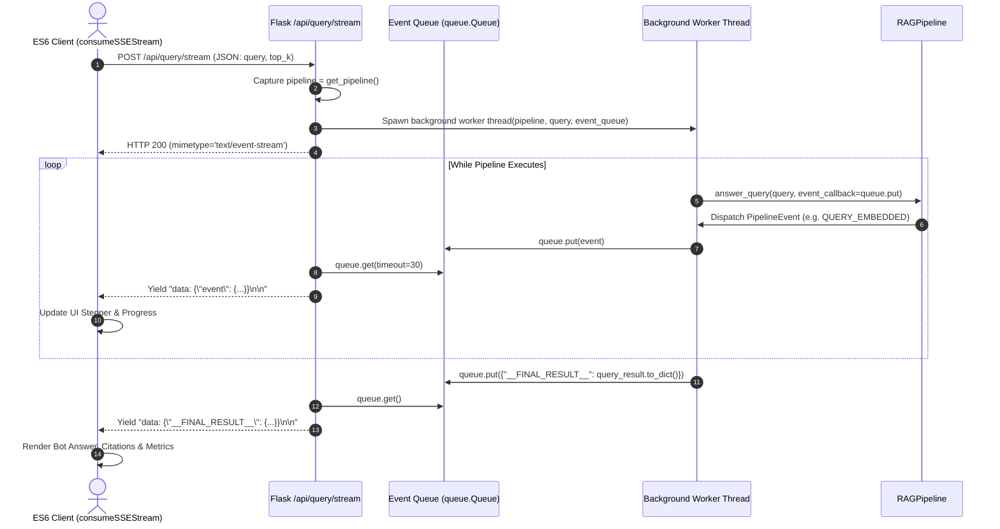

# API, Web Interface & Event Streaming Subsystem

**BRD Requirements Addressed**:
* **FR8**: System shall expose functionality via a Flask API or Streamlit interface.
* **NFR1**: Codebase should be modular (separate backend, API, frontend components).
* **NFR4**: Solution should use the team's existing stack where applicable (Flask).
* **NFR5**: API security, CORS whitelisting, and CSP headers must be enforced.

---

## 1. Overview & Architectural Role

The **API, Web Interface & Event Streaming Subsystem** delivers the user-facing interfaces for Orpheus. It provides a RESTful Flask backend with real-time **Server-Sent Events (SSE)** streaming, a modern **hierarchical ES6 modular frontend**, **modular Jinja2 template partials**, **domain-driven component CSS stylesheets**, and a **Rich-themed CLI**.

In v0.2.0, the subsystem underwent major architectural upgrades:
1. **Pipeline Factory Dependency Injection**: API routes decoupled from singleton pipeline globals (`REFACTOR-API-02`).
2. **Strict Flask-CORS Origin Whitelisting**: Scoped CORS policy protecting local REST and SSE endpoints (`FEAT-API-01`).
3. **Modular ES6 JavaScript Architecture**: Deconstructed monolithic `app.js` into 7 focused ES6 modules (`REFACTOR-UI-01`).
4. **Jinja2 Partials & Domain CSS**: Modularized layout templates and stylesheets (`REFACTOR-UI-02`, `REFACTOR-UI-03`).



---

## 2. Flask Application Factory & Dependency Injection

### 2.1 Factory Pattern (`create_app`)
In `app/main.py`, `create_app()` initializes the Flask application with optional configuration and pipeline injection:

```python
def create_app(test_config: Optional[Dict[str, Any]] = None, pipeline: Optional[RAGPipeline] = None) -> Flask:
    app = Flask(__name__, template_folder=str(BASE_DIR / "templates"), static_folder=str(BASE_DIR / "app" / "static"))
    
    # Configure security headers & CORS
    setup_security_headers(app)
    setup_cors(app, allowed_origins=config.server.cors_origins)
    
    # Dependency Injection: Store pipeline instance in application extensions
    app.extensions["rag_pipeline"] = pipeline if pipeline is not None else RAGPipeline()
    
    app.register_blueprint(api_bp)
    return app
```

### 2.2 Thread-Safe `get_pipeline()` Resolver
Route handlers resolve the pipeline dynamically from the Flask request context, eliminating global module-level singletons:



---

## 3. Security & CORS Architecture

### 3.1 Strict Flask-CORS Origin Whitelisting (`FEAT-API-01`)
CORS is scoped exclusively to the `r"/api/*"` route prefix with strict origin matching (`config.server.cors_origins`):
- **Allowed Origins**: `http://127.0.0.1:5000`, `http://localhost:5000`, `http://127.0.0.1:3000`, `http://localhost:3000`.
- **Preflight Handling**: Responds to `OPTIONS` preflight requests with `Access-Control-Allow-Credentials: true`.
- **Route Isolation**: Non-API routes (e.g. `GET /`) never attach CORS allow headers, protecting static asset delivery.

### 3.2 Content-Security-Policy (CSP) & Defense-in-Depth Headers
Every response passes through `setup_security_headers()` which applies:
- `Content-Security-Policy: default-src 'self'; script-src 'self' 'unsafe-inline'; style-src 'self' 'unsafe-inline' https://fonts.googleapis.com; font-src 'self' https://fonts.gstatic.com;`
- `X-Frame-Options: DENY` (Anti-Clickjacking defense).
- `X-Content-Type-Options: nosniff` (Anti-MIME sniffing).
- `Referrer-Policy: strict-origin-when-cross-origin`.

---

## 4. API Endpoints & Server-Sent Events (SSE) Streaming

### 4.1 REST & SSE Route Inventory

| Endpoint | Method | Transport | Description |
| :--- | :--- | :--- | :--- |
| `/` | `GET` | HTML | Serves the single-page application (`index.html`). |
| `/api/status` | `GET` | JSON | System health, version badge, and ChromaDB collection stats. |
| `/api/documents` | `GET` | JSON | Lists all indexed documents with chunk counts. |
| `/api/documents/<id>` | `DELETE` | JSON | Deletes a document and its chunks from vector storage. |
| `/api/ingest` | `POST` | JSON | Synchronous file upload and ingestion. |
| `/api/ingest/stream` | `POST` | SSE Stream | Streaming file ingestion with live pipeline stage events. |
| `/api/query` | `POST` | JSON | Synchronous question answering. |
| `/api/query/stream` | `POST` | SSE Stream | Real-time question answering with token streaming and stage transitions. |
| `/api/samples` | `POST` | JSON | Seeds the vector store with sample benchmark documents. |
| `/api/evaluate` | `POST` | JSON | Runs the 10-test benchmark suite and returns metrics. |
| `/api/reset` | `POST` | JSON | Wipes and resets the ChromaDB vector collection. |

### 4.2 SSE Streaming Thread Architecture
To deliver instant feedback to the web client during multi-stage processing, streaming endpoints utilize a **worker thread + queue pump pattern**:



---

## 5. Hierarchical ES6 Modular Frontend

The frontend script is deconstructed into cohesive ES6 modules imported dynamically via `<script type="module" src="/static/js/app.js">`:

```
app/static/js/
├── app.js                          # DOMContentLoaded bootstrap & tab routing
├── modules/
│   ├── api.js                      # REST client & consumeSSEStream reader
│   └── state.js                    # Reactive pub-sub event bus
└── components/
    ├── chat.js                     # Message bubbles, citation pills, suggestions
    ├── inspector.js                # Live vertical steppers & metric cards
    ├── ingestion.js                # Dropzone upload, parameter controls, doc list
    ├── evaluation.js               # Benchmark run trigger & diagnostic table
    └── modal.js                    # Reusable chunk/prompt inspector modal
```

### 5.1 Zero-XSS DOM Policy
The client-side JavaScript strictly enforces a **Zero-Tolerance Policy for unsafe DOM injection sinks**:
- **Prohibited**: `innerHTML`, `outerHTML`, `document.write()`, `eval()`, string `setTimeout`.
- **Mandatory Safe APIs**: `element.textContent`, `element.innerText`, `document.createElement()`, `element.setAttribute()`.

```javascript
// Safe DOM node creation in components/chat.js:
const messageDiv = document.createElement("div");
messageDiv.className = "message-bubble bot-message";
messageDiv.textContent = answerText;  // XSS-Safe text injection
```

---

## 6. Modular Jinja2 Templates & Domain CSS

### 6.1 Jinja2 Partials Layout (`templates/`)
- `base.html`: HTML5 shell linking Google Fonts (Inter, Outfit, JetBrains Mono) and modular CSS.
- `index.html`: Container template including partial views.
- `partials/header.html`: Navbar branding, dynamic version badge, status indicator, sample/reset buttons.
- `partials/tab_chat.html`: Chat suggestion chips, message feed, live QA stepper inspector.
- `partials/tab_ingestion.html`: Drag-and-drop dropzone, upload configuration, indexed document cards.
- `partials/tab_evaluation.html`: Benchmark trigger, 5-card metric summary grid, results table.
- `partials/modal_inspector.html`: Reusable inspection dialog card.

### 6.2 Domain-Driven Component CSS (`app/static/css/`)
- `base.css`: Earthy color tokens (`:root`), typography baseline, box-sizing reset.
- `layout.css`: Header, navbar tabs, button system (`btn-primary`, `btn-outline-danger`).
- `components/chat.css`: Chat grid layout, message bubbles, citation pills.
- `components/inspector.css`: Vertical stepper timeline with running/completed/failed state classes.
- `components/ingestion.css`: Dropzone dashed borders, document card layout.
- `components/evaluation.css`: Metric cards, sticky table headers, PASS/FAIL badges.
- `components/modal.css`: Fixed backdrop overlay and modal scroll cards.
- `style.css`: 12-line master stylesheet orchestrating `@import` rules.

---

## 7. CLI Architecture & Theme Tokens

The interactive terminal interface ([`cli.py`](file:///home/remitpe/MAIN/rag-chat/cli.py)) is themed dynamically via [`assets/configs/cli_theme.json`](file:///home/remitpe/MAIN/rag-chat/assets/configs/cli_theme.json):

```json
{
  "icons": {
    "status_waiting": "⏳",
    "status_running": "⚡",
    "status_completed": "✔",
    "status_failed": "✖",
    "prompt_arrow": "›"
  },
  "colors": {
    "banner_border": "bright_blue",
    "table_primary_border": "cyan",
    "success_color": "green",
    "error_color": "red"
  }
}
```

---

## 8. Verification & Automated Tests

The API and web subsystems are verified by automated backend and frontend test suites:

### [`app/api/tests/test_api_security.py`](file:///home/remitpe/MAIN/rag-chat/app/api/tests/test_api_security.py) (12 tests):
* `test_security_headers_present`: Verifies CSP, `X-Frame-Options`, `X-Content-Type-Options` on responses.
* `test_cors_preflight_whitelisted_origin`: Verifies CORS headers for trusted localhost origins.
* `test_cors_preflight_forbidden_origin`: Untrusted origins rejected from receiving CORS headers.
* `test_cors_non_api_route_not_exposed`: `GET /` never exposes CORS headers.
* `test_create_app_with_custom_injected_pipeline`: Verifies pipeline injection through `create_app(pipeline=...)`.
* `test_save_uploaded_file_path_traversal_sanitization`: Traversal paths sanitized to safe basenames.

### [`app/static/js/tests/test_frontend_security.py`](file:///home/remitpe/MAIN/rag-chat/app/static/js/tests/test_frontend_security.py) & [`test_frontend_components.py`](file:///home/remitpe/MAIN/rag-chat/app/static/js/tests/test_frontend_components.py) (8 tests):
* `test_no_unsafe_sinks`: Scans all JS files for prohibited `innerHTML`, `outerHTML`, `document.write`, `eval`.
* `test_enforces_strict_text_content`: Positive assertion for safe `textContent` rendering.
* `test_module_import_graph_resolution`: Verifies 100% resolution of all ES6 relative imports.
* `test_api_transport_client_contracts`: Verifies export contracts and SSE parser logic in `api.js`.
