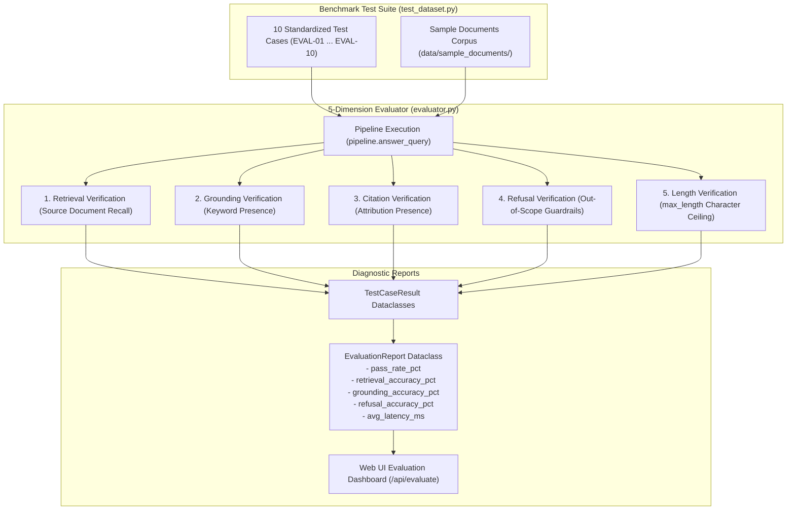
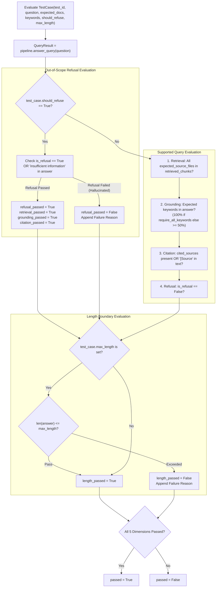

# Evaluation Benchmark & Quality Assurance Subsystem

**BRD Requirements Addressed**:
* **Evaluation Criteria**: Correctness (retrieval and grounding), Citation Accuracy, Robustness (anti-hallucination refusal), Code Quality, Depth of Evaluation.
* **Deliverable Day 3**: Evaluation writeup and test execution against 8–10 standardized test questions.
* **NFR1**: Modular test architecture collocated with source packages.

---

## 1. Overview & Architectural Role

The **Evaluation Benchmark & Quality Assurance Subsystem** provides automated, objective validation of the RAG pipeline's retrieval fidelity, factual grounding, citation attribution, refusal accuracy, and length constraints. It enables developers, interns, and supervisors to stress-test pipeline accuracy across diverse document domains and immediately detect regressions.

In v0.2.0, the benchmark engine was enhanced with **strict length boundaries (`max_length`)**, **demanding 100% keyword recall constraints (`require_all_keywords`)** (`FEAT-EVAL-01`), **enriched real-world sample documents** (`DOC-EVAL-02`), and a **collocated testing architecture with frontend static security scanning** (`REFACTOR-TEST-01`, `FEAT-TEST-02`).



---

## 2. The 5 Evaluation Dimensions

`RAGEvaluator.evaluate_test_case()` scores each test case across 5 discrete dimensions:



### Detailed Evaluation Rules:
1. **Retrieval Accuracy**:
   $$\forall \text{doc} \in \text{expected\_source\_files}, \exists \text{src} \in \text{retrieved\_sources} \text{ s.t. } \text{doc.lower()} \subseteq \text{src.lower()}$$
2. **Grounding Accuracy**:
   - **Text & Punctuation Normalization**: Evaluator applies regex normalization ($\text{re.sub(r'[\s\-_,]+', ' ', text)}$) so numbers formatted with or without commas (`6,000` vs `6000`) and hyphens match robustly across different model tokenizers.
   - If `require_all_keywords == True`: All `expected_keywords` must appear in the answer.
   - If `require_all_keywords == False`: At least $\max(1, \lfloor N/2 \rfloor)$ keywords must appear.
3. **Citation Accuracy**:
   $$\text{len}(\text{cited\_sources}) > 0 \lor \text{"[Source"} \in \text{answer}$$
4. **Refusal Accuracy**:
   - Unsupported queries must refuse (preventing hallucination).
   - Supported queries must *not* refuse.
5. **Length Constraint**:
   $$\text{effective\_len}(\text{answer}) \le \text{max\_length}$$
   *(Note: Citation tags like `[Source 1]` are excluded when computing effective length to avoid penalizing standard document attribution).*

---

## 3. Standardized 10-Question Benchmark Test Suite

The benchmark suite in [`app/evaluation/test_dataset.py`](file:///home/remitpe/MAIN/rag-chat/app/evaluation/test_dataset.py) evaluates diverse query types:

| Test ID | Question Summary | Category | Expected Source | Key Constraints |
| :--- | :--- | :--- | :--- | :--- |
| **EVAL-01** | Core collaboration hours at Acme Corp | `factual_single_doc` | `acme_hr_policy.txt` | `max_length=250`, `require_all_keywords=True` |
| **EVAL-02** | Home office equipment stipend & in-office days | `factual_single_doc` | `acme_hr_policy.txt` | Bulleted list format, `require_all_keywords=True` |
| **EVAL-03** | Monthly downtime limit for 99.99% cloud SLA | `factual_single_doc` | `cloud_architecture_handbook.txt` | `max_length=150`, `require_all_keywords=True` |
| **EVAL-04** | Redis default caching TTL values | `factual_single_doc` | `cloud_architecture_handbook.txt` | List items, `require_all_keywords=True` |
| **EVAL-05** | Solar monocrystalline panel efficiency range | `factual_single_doc` | `renewable_energy_faq.txt` | `require_all_keywords=True` |
| **EVAL-06** | LiFePO4 battery cycle life at 80% DoD | `factual_single_doc` | `renewable_energy_faq.txt` | Punctuation normalization, `require_all_keywords=True` |
| **EVAL-07** | Embedding model and vector dimension | `factual_single_doc` | `doc_qa_system_manual.txt` | `max_length=250`, `require_all_keywords=True` |
| **EVAL-08** | Interstellar space travel reimbursement policy | `out_of_scope_refusal` | *(None)* | `should_refuse=True` (Hallucination test) |
| **EVAL-09** | Acme stock price prediction for next year | `out_of_scope_refusal` | *(None)* | `should_refuse=True` (Speculation test) |
| **EVAL-10** | Synthesis of cloud circuit breaker & parental leave | `factual_multi_doc` | `cloud_architecture...`, `acme_hr...` | Cross-document synthesis, `require_all_keywords=True` |

---

## 4. Enriched Sample Documents Corpus

The sample corpus (`data/sample_documents/`) contains dense, realistic long-form content:

1. `acme_hr_policy.txt`: Core hours (10 AM–3 PM ET), mandatory in-office days (Tue/Thu), $750 home office equipment stipend with 90-day receipt submission, PTO accrual (20 days + 10 sick days), 16-week parental leave with concurrent FMLA rules.
2. `cloud_architecture_handbook.txt`: 99.99% SLA definition (4.38 minutes/month downtime budget), Redis caching TTLs (15-min session, 24-h static config), exponential backoff retry parameters (3 retries, 200ms base, 50% jitter), and circuit breaker trigger thresholds (50% failure rate over 60s sliding window).
3. `renewable_energy_faq.txt`: Mono PERC solar panel efficiency (20%–22.8% under STC), 25-year 85% warranty, LiFePO4 battery cycle life (6,000–8,000 cycles at 80% DoD), and operating temperature ranges (15°C–35°C).
4. `doc_qa_system_manual.txt`: RAG architectural breakdown, 500-character chunking with 50-character overlap, MiniLM-L6-v2 384-dimensional embeddings, ChromaDB vector indexing, and anti-hallucination prompt mechanics.

---

## 5. Collocated Quality Assurance & Test Architecture

In v0.2.0, the entire test suite was restructured into a **high-cohesion collocated architecture** (`REFACTOR-TEST-01`):

```
app/
├── api/tests/
│   └── test_api_security.py         # 12 tests (CORS, CSP, DI factory, upload sanitization)
├── chunking/tests/
│   └── test_chunking.py             # Unit tests (recursive splitting, token estimator, separators)
├── embedding/tests/
│   └── test_embedding.py            # 5 tests (distance_to_similarity invariants, batch shapes)
├── ingestion/tests/
│   └── test_ingestion.py            # 9 tests (parser registry OCP, SHA-256 buffer invariance)
├── retrieval/tests/
│   └── test_retrieval.py            # 6 tests (thresholding, top_k slicing, doc filtering)
├── augmentation/tests/
│   └── test_prompt_builder.py       # 6 tests (prompt asset loading, citation mapping)
├── generation/tests/
│   └── test_generator.py            # 7 tests (offline extractive fallback, refusal detection)
├── storage/tests/
│   └── test_vector_store.py         # 7 tests (HNSW space metadata, paginated batch loop)
├── evaluation/tests/
│   └── test_evaluation.py           # Evaluator scoring verification
└── static/js/tests/
    ├── test_frontend_security.py    # AST scanner enforcing ZERO unsafe DOM sinks (innerHTML)
    └── test_frontend_components.py  # ES6 module import graph and lifecycle hook contracts
tests/
└── integration/
    └── test_pipeline.py             # End-to-end multi-stage pipeline integration tests
```

### 5.1 Automated Test Execution (`pytest.ini`)
`pytest.ini` configures root discovery paths:
```ini
[pytest]
testpaths = app tests
python_files = test_*.py
```
Executing `python3 -m pytest -v` runs all **67+ automated unit, security, and integration tests** in under 5 seconds.
