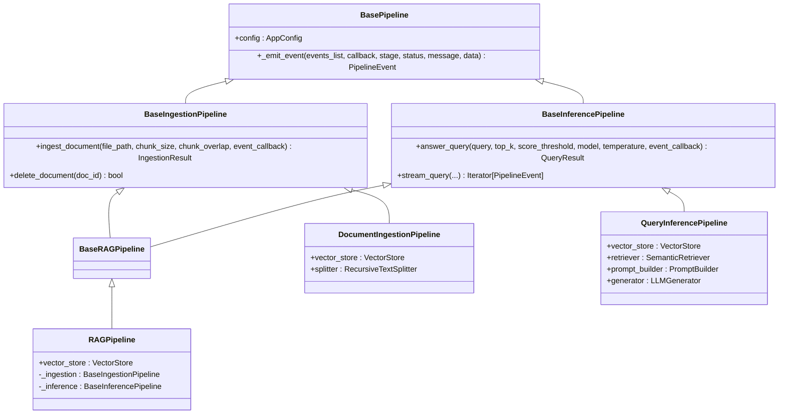

# Pipeline Modularity & Abstract Interfaces

**Addresses NFR1**: Codebase should be modular (separate backend, API, frontend components).

---

## 1. Overview

From v0.2.2, the Orpheus pipeline layer is restructured around **abstract base classes (ABCs)** and
a **factory function** pattern. All downstream consumers (Flask routes, CLI, Evaluator, tests)
depend strictly on abstract interfaces defined in `app/pipeline/base.py`, never on concrete classes
directly. This enforces **high cohesion** and **low coupling** across the entire system.

```
app/pipeline/
├── base.py                ← Abstract base classes (single source of truth for interfaces)
├── events.py              ← PipelineEvent / EventStage / EventStatus / EventCallback
├── models.py              ← IngestionResult / QueryResult (shared dataclasses)
├── ingestion_pipeline.py  ← DocumentIngestionPipeline (Stages 1–3)
├── inference_pipeline.py  ← QueryInferencePipeline (Stages 4–7)
├── factory.py             ← create_rag_pipeline / create_ingestion_pipeline / create_inference_pipeline
├── rag_pipeline.py        ← RAGPipeline (Facade) — delegates to sub-pipelines
└── __init__.py            ← Package-level exports of all public symbols
```

---

## 2. Abstract Base Class Hierarchy



### Dependency Direction

```
Consumers → Base ABCs ← Concrete Sub-Pipelines
```

Nothing in the upper layers imports a concrete class; they always import an abstract base.

---

## 3. Abstract Bases in Detail

### `BasePipeline` (`app/pipeline/base.py`)

Root class. Provides `config` (resolved `AppConfig`) and the shared `_emit_event()` utility that all
sub-pipelines use to dispatch `PipelineEvent` objects to both the internal event log and the optional
`EventCallback` caller.

### `BaseIngestionPipeline`

Covers Stages 1–3 of the Orpheus pipeline:

| Abstract Method | Responsibility |
|---|---|
| `ingest_document(file_path, ...)` | Validate, parse, chunk, embed, and index a document |
| `delete_document(doc_id)` | Remove all chunks for a document from the vector store |

### `BaseInferencePipeline`

Covers Stages 4–7:

| Method | Responsibility |
|---|---|
| `answer_query(query, ...)` (**abstract**) | Retrieve, augment, and generate a grounded answer |
| `stream_query(query, ...)` | No-op default; override for SSE event streaming |

### `BaseRAGPipeline`

Combined marker interface. Satisfies both `BaseIngestionPipeline` and `BaseInferencePipeline`.
Use this type when a consumer needs full ingestion + inference capabilities.

---

## 4. Concrete Implementations

### `DocumentIngestionPipeline` (`ingestion_pipeline.py`)

Owns **Stages 1–3** exclusively. Contains no LLM, retriever, or prompt-builder components — making
it the lightest variant for bulk indexing or CLI ingest-only workflows.

```python
from app.pipeline.ingestion_pipeline import DocumentIngestionPipeline

ingestion = DocumentIngestionPipeline(app_config=cfg)
result = ingestion.ingest_document("/path/to/document.pdf")
```

### `QueryInferencePipeline` (`inference_pipeline.py`)

Owns **Stages 4–7** exclusively. Requires only a pre-populated `VectorStore` — contains no parser
or chunker dependencies.

```python
from app.pipeline.inference_pipeline import QueryInferencePipeline

inference = QueryInferencePipeline(app_config=cfg, vector_store=shared_store)
result = inference.answer_query("What are the core hours?")
```

### `RAGPipeline` (`rag_pipeline.py`) — Facade

The unified entry point. Satisfies `BaseRAGPipeline`. Internally composes one
`DocumentIngestionPipeline` and one `QueryInferencePipeline` sharing the same `VectorStore`.

```python
from app.pipeline.rag_pipeline import RAGPipeline

pipeline = RAGPipeline()
pipeline.ingest_document(path)
result = pipeline.answer_query("...")
```

---

## 5. Factory Functions (`factory.py`)

All pipeline consumers must use these factory functions rather than constructing concrete classes
directly. This ensures instantiation logic stays in one place.

| Factory | Returns | Use When |
|---|---|---|
| `create_rag_pipeline()` | `BaseRAGPipeline` | Full ingestion + inference (Flask, CLI, tests) |
| `create_ingestion_pipeline()` | `BaseIngestionPipeline` | Ingest-only worker, no LLM needed |
| `create_inference_pipeline()` | `BaseInferencePipeline` | Query-only worker on existing index |

```python
from app.pipeline.factory import (
    create_rag_pipeline,
    create_ingestion_pipeline,
    create_inference_pipeline,
)

# Full pipeline
pipeline = create_rag_pipeline()

# Shared VectorStore pattern (ingestion & inference on same index)
from app.storage.vector_store import VectorStore
shared_store = VectorStore(persist_dir=cfg.storage.persist_dir, collection_name=cfg.storage.collection_name)
ingest = create_ingestion_pipeline(vector_store=shared_store)
infer  = create_inference_pipeline(vector_store=shared_store)
```

---

## 6. Consumer Interface Contracts

| Consumer | Required Interface | Reason |
|---|---|---|
| `app/api/routes.py` `get_pipeline()` | `BaseRAGPipeline` | Needs both ingest & query routes |
| `app/main.py` `create_app()` | `BaseRAGPipeline` | Full DI for Flask app |
| `cli.py` `handle_*` functions | `BaseRAGPipeline` | CLI exposes all commands |
| `app/evaluation/evaluator.py` `RAGEvaluator` | `BaseInferencePipeline` | Only calls `answer_query()` |

---

## 7. Result Dataclasses (`models.py`)

`IngestionResult` and `QueryResult` are defined in `app/pipeline/models.py` (not in
`rag_pipeline.py`) to avoid circular imports. They are re-exported from `rag_pipeline.py` for
backward compatibility:

```python
# Both of these work identically:
from app.pipeline.models import IngestionResult, QueryResult      # preferred
from app.pipeline.rag_pipeline import IngestionResult, QueryResult  # backward compat
```
