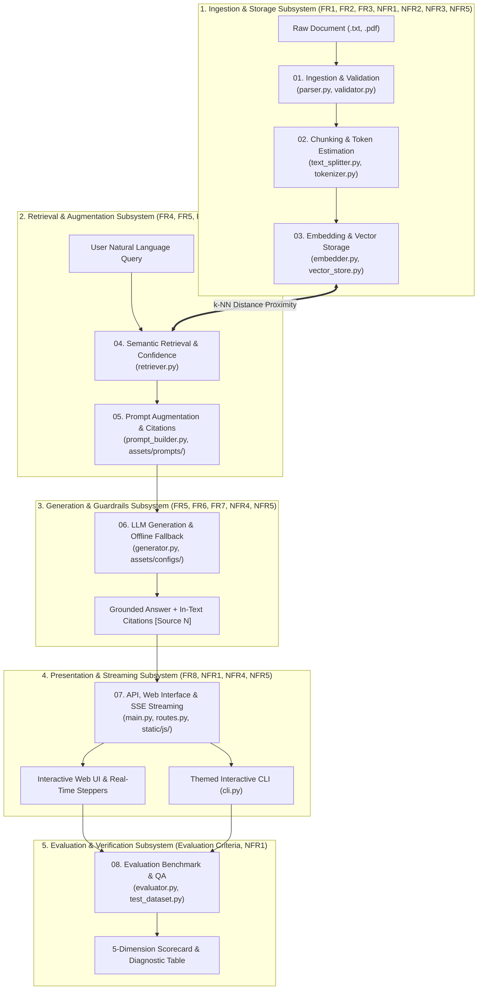
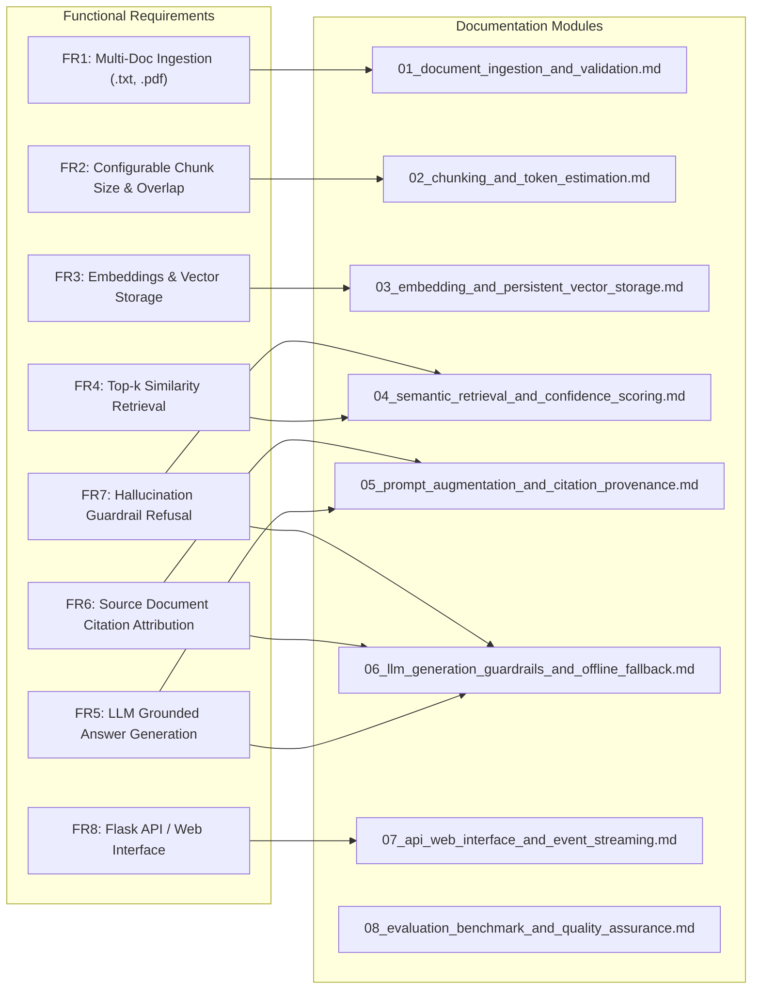

# Orpheus

Welcome to the comprehensive technical documentation for the **Orpheus (Mini RAG System)** v0.2.0 release. This documentation suite provides an in-depth, architectural breakdown of the entire RAG pipeline, directly mapped to the **Business Requirements Document (BRD)**.

---

## 1. System Architecture Map



---

## 2. Documentation Directory Index

| # | Document | BRD Requirements | Key Architectural Components |
| :---: | :--- | :--- | :--- |
| **01** | [**Document Ingestion & Validation**](./01_document_ingestion_and_validation.md) | **FR1**, **NFR1**, **NFR5** | Multi-document upload, path traversal protection, streaming SHA-256 deduplication, deterministic UUID5 generation, Parser Strategy Registry pattern (`BaseDocumentParser`, `TXTDocumentParser`, `PDFDocumentParser`). |
| **02** | [**Text Chunking & Token Estimation**](./02_chunking_and_token_estimation.md) | **FR2**, **NFR1** | Recursive text splitting, configurable separator hierarchy (`ChunkConfig.separators`), sliding overlap boundaries, decoupled token estimation engine (`estimate_tokens`), chunk provenance tracking. |
| **03** | [**Embedding & Vector Storage**](./03_embedding_and_persistent_vector_storage.md) | **FR3**, **NFR2**, **NFR3** | MiniLM 384-d embeddings, unified `distance_to_similarity()` mapping across metric spaces, persistent ChromaDB SQLite + HNSW storage, dynamic `hnsw:space` metadata, safe paginated batch insertion loop. |
| **04** | [**Semantic Retrieval & Scoring**](./04_semantic_retrieval_and_confidence_scoring.md) | **FR4**, **FR7**, **NFR1**, **NFR3** | Query vector embedding, k-NN vector search, dynamic `top_k` and `score_threshold` filtering, confidence evaluation (`is_confident`, `has_relevant_context`), metric-agnostic ranking. |
| **05** | [**Prompt Augmentation & Citations**](./05_prompt_augmentation_and_citation_provenance.md) | **FR5**, **FR6**, **FR7** | Versioned external prompt assets (`assets/prompts/`), 1-indexed citation dictionary (`citations_map`), structured context block formatting, strict grounded answering contract, empty context fallback. |
| **06** | [**LLM Generation & Guardrails**](./06_llm_generation_guardrails_and_offline_fallback.md) | **FR5**, **FR6**, **FR7**, **NFR4**, **NFR5** | LiteLLM multi-provider dispatch (Gemini, OpenRouter, OpenAI, Ollama), Pydantic 2.13+ compatibility shim, hallucination refusal guardrails (`generation_texts.json`), grounded offline extractive fallback (`nlp_stopwords.json`), citation extraction. |
| **07** | [**API, Web Interface & Streaming**](./07_api_web_interface_and_event_streaming.md) | **FR8**, **NFR1**, **NFR4**, **NFR5** | Flask application factory (`create_app(pipeline=...)`), thread-safe `get_pipeline()`, Flask-CORS origin whitelisting, CSP headers, Server-Sent Events (SSE) streaming thread pump, hierarchical ES6 modular frontend (`app/static/js/`), Jinja2 partials, domain CSS, Rich CLI theme. |
| **08** | [**Evaluation Benchmark & QA**](./08_evaluation_benchmark_and_quality_assurance.md) | **Evaluation Criteria**, **NFR1** | 5-dimension evaluation engine (`RAGEvaluator`), 10 benchmark test cases (`test_dataset.py`) with `max_length` and `require_all_keywords`, enriched sample documents corpus, collocated test suite (67+ tests), AST static frontend security scanner. |

---

## 3. BRD Requirements Traceability Matrix



---

## 4. Quick Reference: Running & Testing the System

### Start the Web Application
```bash
python3 app/main.py
# Server running at: http://127.0.0.1:5000
```

### Launch the Interactive CLI
```bash
python3 cli.py --interactive
```

### Run the Full Collocated Test Suite
```bash
python3 -m pytest -v
# Runs all 67+ backend, frontend security, and integration tests
```

### Run the Automated Evaluation Benchmark
```bash
python3 cli.py --evaluate
# Evaluates the 10-test benchmark suite and prints diagnostic metrics
```
